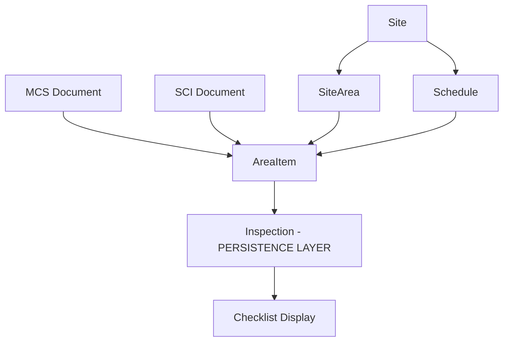

# Cleaning System Interfaces and Relationships

## Overview
This document outlines the complete interface hierarchy and relationships between Checklist, MCS, SCI, Sites, SiteAreas, Schedules, and Inspection models in the iClean VX cleaning management system.

> **🎯 CRITICAL**: The `InspectionModel` interface is the primary persistence model after iCleaner verification is completed. All cleaning verification data flows into this model for permanent storage and audit trails.

## Core Data Flow



## 1. Primary Interfaces

### 1.1 InspectionModel (Primary Persistence Layer) ⭐
**Location**: `/src/app/features/cleaning/models/inspection.ts`

```typescript
interface InspectionModel {
  id?: string;
  
  // Core References
  areaItemId: string;        // Links to AreaItem
  siteId: string;            // Links to Site
  scheduleId?: string;       // Links to Schedule
  
  // Verification Data (Persisted after iCleaner)
  status: 'pass' | 'fail' | 'partial' | 'na';
  verifiedBy: string;        // User who performed verification
  verifiedAt: Date;          // Timestamp of verification
  
  // Additional Verification Details
  notes?: string;            // Inspector notes
  issues?: string[];         // List of identified issues
  correctiveActions?: string[]; // Required actions
  photos?: string[];         // Photo evidence URLs
  
  // Signatures & Compliance
  signature?: string;        // Digital signature
  supervisorApproval?: {
    approvedBy: string;
    approvedAt: Date;
    comments?: string;
  };
  
  // Metadata
  createdBy: string;
  createdAt: Date;
  updatedAt: Date;
  companyId: string;
  
  // Mobile Sync
  iCleanerSyncId?: string;   // Reference to mobile app sync
  syncedAt?: Date;
  deviceId?: string;
}
```

### 1.2 AreaItemModel (Bridge Between Documents and Inspections)
**Location**: `/src/app/features/cleaning/models/area-items.ts`

```typescript
interface AreaItemModel {
  id?: string;
  
  // Core Identifiers
  areaName: string;          // From SiteArea
  itemName: string;          // What is being cleaned
  
  // Document Linking (Bidirectional)
  mcsDocumentId?: string;    // Source MCS document
  mcsItemIndex?: number;     // Position in MCS array
  sciDocumentId?: string;    // Linked SCI document
  
  // Schedule & Location
  siteId: string;
  areaId: string;            // SiteArea reference
  scheduleId: string;        // Cleaning frequency
  
  // Cleaning Details
  frequency: CleaningFrequency;
  method?: string;           // Cleaning method from SCI
  productConcentration?: string;
  contactTime?: string;
  ppe?: string[];           // Required PPE
  
  // HACCP & Compliance
  isCCP: boolean;           // Critical Control Point
  colorCode?: string;       // Equipment color coding
  riskLevel?: 'high' | 'medium' | 'low';
  
  // Status & Tracking
  isActive: boolean;
  lastInspectionId?: string;
  lastInspectionDate?: Date;
  nextDueDate?: Date;
  
  // Metadata
  createdBy: string;
  createdAt: Date;
  updatedAt: Date;
  companyId: string;
}
```

### 1.3 MCS Document Interface
**Location**: `/src/app/features/documents/components/mcs-content-viewer/`

```typescript
interface MCSDocument {
  id: string;
  documentNumber: string;
  title: string;
  
  // Cleaning Schedule Items (Array)
  cleaningScheduleItems: CleaningScheduleItem[];
  
  // Linked AreaItems (Bidirectional Reference)
  linkedAreaItems?: {
    [itemIndex: number]: string[]; // Map of array index to AreaItem IDs
  };
  
  // Document Control
  effectiveDate: Date;
  reviewDate: Date;
  version: string;
  status: 'draft' | 'active' | 'archived';
  
  // Metadata
  siteId: string;
  companyId: string;
  createdBy: string;
  approvedBy?: string;
}

interface CleaningScheduleItem {
  area: string;              // Physical area
  item: string;              // What to clean
  frequency: string;         // How often
  method?: string;           // Cleaning method
  sciReference?: string;     // Link to SCI document
  productConcentration?: string;
  contactTime?: string;
  ppe?: string[];
  colorCode?: string;        // HACCP color coding
  isCCP?: boolean;
}
```

### 1.4 SCI Document Interface
**Location**: `/src/app/features/documents/components/sci-content-viewer/`

```typescript
interface SCIDocument {
  id: string;
  documentNumber: string;
  title: string;
  
  // Cleaning Instructions
  purpose: string;
  scope: string;
  responsibilities: string;
  
  // Detailed Instructions
  cleaningSteps: CleaningStep[];
  
  // Materials & Equipment
  cleaningProducts: Product[];
  equipment: Equipment[];
  ppe: PPEItem[];
  
  // Safety & Compliance
  safetyPrecautions: string[];
  environmentalConsiderations?: string[];
  qualityChecks: QualityCheck[];
  
  // Linked AreaItems
  linkedAreaItemIds?: string[];
  
  // Document Control
  effectiveDate: Date;
  reviewDate: Date;
  version: string;
  
  // Metadata
  companyId: string;
  createdBy: string;
  approvedBy?: string;
}

interface CleaningStep {
  stepNumber: number;
  description: string;
  criticalControl?: boolean;
  verificationMethod?: string;
  acceptanceCriteria?: string;
}
```

### 1.5 ChecklistItemModel (Display Layer)
**Location**: `/src/app/features/cleaning/models/checklist-item.ts`

```typescript
interface ChecklistItemModel {
  id: string;
  
  // References
  areaItemId: string;        // Links to AreaItem
  siteId: string;
  month: number;             // 1-12
  year: number;
  
  // Daily Status Fields (d1-d31)
  d1?: CheckStatus;
  d2?: CheckStatus;
  d3?: CheckStatus;
  // ... continues to d31
  d31?: CheckStatus;
  
  // Display Information
  areaName: string;
  itemName: string;
  frequency: string;
  
  // Summary Stats
  completionRate?: number;
  failureCount?: number;
  missedCount?: number;
  
  // Metadata
  companyId: string;
  createdAt: Date;
  updatedAt: Date;
}

type CheckStatus = 'completed' | 'failed' | 'missed' | 'na' | 'pending';
```

### 1.6 SiteAreaModel
**Location**: `/src/app/features/cleaning/models/site-area.ts`

```typescript
interface SiteAreaModel {
  id: string;
  name: string;              // Area name
  
  // Hierarchy & Location
  siteId: string;
  parentAreaId?: string;     // For nested areas
  level: number;             // Hierarchy level
  path: string;              // Full path (e.g., "Production/Packaging/Line1")
  
  // Area Classification
  type: 'production' | 'storage' | 'office' | 'utility' | 'external';
  riskLevel: 'high' | 'medium' | 'low';
  isControlledEnvironment: boolean;
  
  // HACCP & Compliance
  isCriticalArea: boolean;
  hacpcZone?: 'high-risk' | 'low-risk' | 'non-production';
  requiredPPE?: string[];
  accessRestrictions?: string[];
  
  // Cleaning Requirements
  defaultFrequency?: CleaningFrequency;
  specialRequirements?: string[];
  
  // Status
  isActive: boolean;
  
  // Metadata
  companyId: string;
  createdBy: string;
  createdAt: Date;
  updatedAt: Date;
}
```

### 1.7 ScheduleModel
**Location**: `/src/app/features/cleaning/models/schedule.ts`

```typescript
interface ScheduleModel {
  id: string;
  name: string;              // Schedule name
  code: string;              // Short code (e.g., "D", "W", "M")
  
  // Frequency Definition
  frequency: CleaningFrequency;
  intervalDays?: number;     // For custom intervals
  
  // Specific Days (for weekly/monthly)
  daysOfWeek?: number[];     // 0-6 (Sunday-Saturday)
  daysOfMonth?: number[];    // 1-31
  
  // Time Windows
  preferredTime?: string;    // e.g., "06:00-08:00"
  duration?: number;         // Expected duration in minutes
  
  // Cycle Information
  cycleType: 'daily' | 'weekly' | 'monthly' | 'quarterly' | 'annual' | 'custom';
  repeatEvery?: number;      // e.g., every 2 weeks
  
  // Validation Rules
  allowWeekends: boolean;
  allowHolidays: boolean;
  requiresDowntime: boolean;
  
  // Status
  isActive: boolean;
  
  // Metadata
  siteId: string;
  companyId: string;
  createdAt: Date;
  updatedAt: Date;
}

enum CleaningFrequency {
  DAILY = 'daily',
  WEEKLY = 'weekly',
  FORTNIGHTLY = 'fortnightly',
  MONTHLY = 'monthly',
  QUARTERLY = 'quarterly',
  ANNUALLY = 'annually',
  AS_REQUIRED = 'as_required',
  CUSTOM = 'custom'
}
```

### 1.8 SiteModel
**Location**: `/src/app/models/sites.ts`

```typescript
interface Site {
  id: string;
  name: string;
  code?: string;
  
  // Company & Location
  companyId: string;
  address?: Address;
  timezone?: string;
  
  // Site Classification
  type: 'production' | 'warehouse' | 'office' | 'retail' | 'mixed';
  industryType?: string;     // e.g., "food_processing", "pharmaceutical"
  
  // Operational Settings
  operatingHours?: {
    monday?: { open: string; close: string; };
    // ... other days
  };
  productionShifts?: Shift[];
  
  // Cleaning Configuration
  defaultCleaningSettings?: {
    allowPartialCompletion: boolean;
    requirePhotoEvidence: boolean;
    requireSupervisorApproval: boolean;
    maxDaysBackfill: number;
  };
  
  // Area & Schedule Management
  areaCount?: number;
  scheduleCount?: number;
  activeAreaItems?: number;
  
  // Compliance
  certifications?: string[];
  auditSchedule?: string;
  
  // Status
  isActive: boolean;
  goLiveDate?: Date;
  
  // Metadata
  createdBy: string;
  createdAt: Date;
  updatedAt: Date;
}
```

## 2. Relationship Mappings

### 2.1 MCS → AreaItem → Inspection Flow

```
MCS Document
    ↓ (cleaningScheduleItems array)
CleaningScheduleItem
    ↓ (generates via import)
AreaItem (with mcsDocumentId + mcsItemIndex)
    ↓ (scheduled for inspection)
Inspection (with areaItemId reference)
    ↓ (displayed in)
Checklist (monthly view with d1-d31 status)
```

### 2.2 Bidirectional References

```
MCS Document ←→ AreaItems
  - MCS.linkedAreaItems[index] → AreaItem.id[]
  - AreaItem.mcsDocumentId → MCS.id
  - AreaItem.mcsItemIndex → array position

SCI Document ←→ AreaItems
  - SCI.linkedAreaItemIds → AreaItem.id[]
  - AreaItem.sciDocumentId → SCI.id

AreaItem ←→ Inspection
  - AreaItem.lastInspectionId → Inspection.id
  - Inspection.areaItemId → AreaItem.id
```

### 2.3 Hierarchical Relationships

```
Company
  ↓
Site
  ↓ → Schedules
  ↓ → SiteAreas
       ↓
     AreaItems
       ↓
    Inspections (PERSISTENCE)
       ↓
    Checklists (DISPLAY)
```

## 3. Data Persistence Flow

### 3.1 iCleaner Verification to Database

```typescript
// 1. Mobile app captures inspection data
const mobileInspection = {
  areaItemId: "ai_123",
  status: "pass",
  verifiedBy: "user@example.com",
  verifiedAt: new Date(),
  photos: ["photo1.jpg", "photo2.jpg"],
  notes: "Area cleaned according to SCI-2025-0042"
};

// 2. Sync to Firebase (InspectionModel)
const inspection = await inspectionService.create({
  ...mobileInspection,
  siteId: areaItem.siteId,
  scheduleId: areaItem.scheduleId,
  companyId: this.authService.currentCompany.id,
  iCleanerSyncId: mobile.syncId,
  syncedAt: new Date()
});

// 3. Update AreaItem with last inspection
await areaItemService.update(areaItemId, {
  lastInspectionId: inspection.id,
  lastInspectionDate: inspection.verifiedAt,
  nextDueDate: calculateNextDue(schedule)
});

// 4. Update Checklist display
await checklistService.updateDayStatus(
  inspection.verifiedAt.getDate(), // day of month
  inspection.status
);
```

### 3.2 Query Patterns

```typescript
// Get all inspections for an area item
const inspections = await db.collection('companies')
  .doc(companyId)
  .collection('inspections')
  .where('areaItemId', '==', areaItemId)
  .orderBy('verifiedAt', 'desc')
  .get();

// Get today's pending inspections
const pending = await db.collection('companies')
  .doc(companyId)
  .collection('areaItems')
  .where('nextDueDate', '<=', today)
  .where('isActive', '==', true)
  .get();

// Get monthly checklist data
const checklist = await db.collection('companies')
  .doc(companyId)
  .collection('checklists')
  .where('siteId', '==', siteId)
  .where('month', '==', currentMonth)
  .where('year', '==', currentYear)
  .get();
```

## 4. Critical Integration Points

### 4.1 Document Import Process
When MCS documents are imported:
1. Parse `cleaningScheduleItems` array
2. Create/update `AreaItem` records
3. Link back to MCS via `mcsDocumentId` and `mcsItemIndex`
4. Update MCS `linkedAreaItems` map
5. Link to SCI documents if referenced

### 4.2 Inspection Creation
When creating inspections:
1. Reference `AreaItem` for cleaning requirements
2. Pull SCI instructions if linked
3. Create `Inspection` record with verification data
4. Update `AreaItem` last inspection details
5. Update `Checklist` day status

### 4.3 Checklist Generation
Monthly checklist generation:
1. Query all active `AreaItems` for site
2. Create `ChecklistItem` for each area/item combination
3. Populate frequency from `Schedule`
4. Update daily status (d1-d31) from `Inspections`
5. Calculate completion statistics

## 5. Service Layer Architecture

```typescript
// Core Services
class AreaItemsService extends BaseService<AreaItemModel> {
  // Handles MCS/SCI linking and area item management
}

class InspectionService extends BaseService<InspectionModel> {
  // PERSISTENCE LAYER - stores verification results
}

class ChecklistService extends BaseService<ChecklistItemModel> {
  // Display layer - monthly view generation
}

class McsAreaItemsService {
  // Specialized service for MCS import and linking
  linkMcsToAreaItems(mcsDoc, areaItems);
  unlinkMcsFromAreaItems(mcsDoc, areaItems);
}

class ScheduleService extends BaseService<ScheduleModel> {
  // Frequency and cycle management
}

class SiteAreaService extends BaseService<SiteAreaModel> {
  // Physical location management
}
```

## 6. Database Collections

```
companies/{companyId}/
  ├── areaItems/          # Bridge between docs and inspections
  ├── inspections/        # PERSISTENCE - verification results
  ├── checklists/         # Display layer - monthly views
  ├── sites/              # Physical locations
  ├── siteAreas/          # Areas within sites
  ├── schedules/          # Cleaning frequencies
  ├── documents/          # MCS and SCI documents
  └── documentCategories/ # Document type definitions
```

## 7. Key Validation Rules

1. **AreaItem Creation**: Must have valid siteId, areaId, and scheduleId
2. **Inspection Creation**: Must reference existing AreaItem
3. **MCS Linking**: Can only link to AreaItems in same site
4. **SCI Linking**: Multiple AreaItems can reference same SCI
5. **Checklist Generation**: One per site/month combination
6. **Schedule Assignment**: Must match site's operational hours

## 8. Mobile Sync Considerations

The `InspectionModel` includes fields specifically for mobile sync:
- `iCleanerSyncId`: Unique ID from mobile device
- `syncedAt`: Timestamp of last sync
- `deviceId`: Mobile device identifier

This ensures data integrity when inspections are performed offline and synced later.

## Summary

The `InspectionModel` serves as the **critical persistence layer** for the entire cleaning verification system. It captures and stores all verification data from iCleaner mobile app, maintaining full traceability from document definitions (MCS/SCI) through to completed inspections. The bidirectional linking between MCS documents and AreaItems ensures consistency and enables both forward workflow processing and backward audit trails.