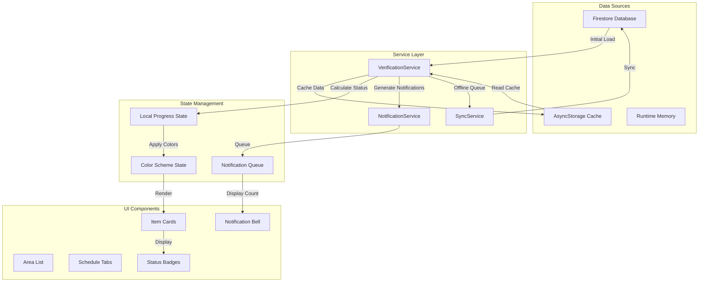
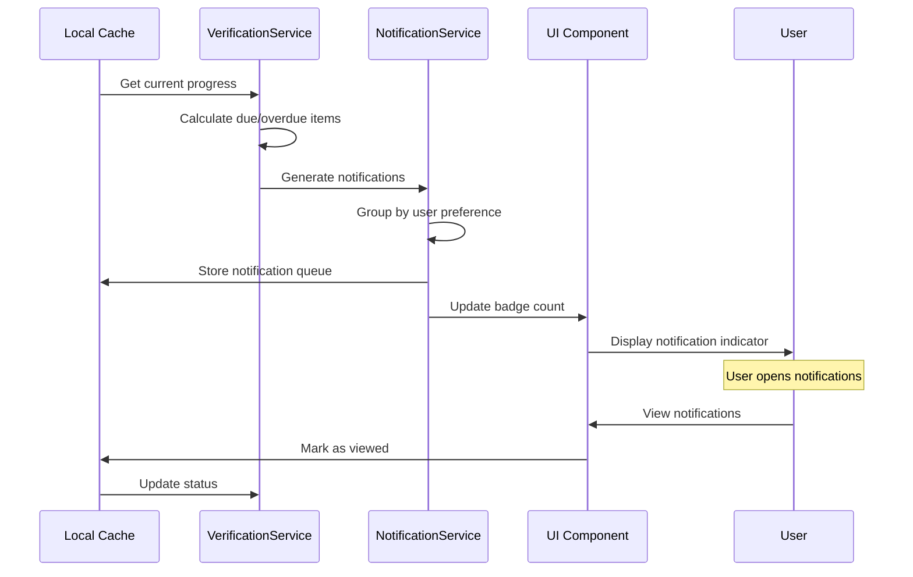

# iCleanVerification - Local Cache to UI Status Flow Documentation

## Overview
This document details how the local cache system integrates with the UI to provide real-time status tracking, color coding, and notifications for the iCleanVerification feature.

## Architecture Flow



## Local Cache Structure

### AsyncStorage Keys
```typescript
@iCleanVerification:progress:{areaId}  // Main progress tracking
@iCleanVerification:config             // User preferences
@iCleanVerification:offlineQueue       // Pending sync items
@iCleanVerification:photos:{photoId}   // Cached photos
@iCleanVerification:lastSync           // Last sync timestamp
```

### Progress Data Flow

1. **Initial Load**
   ```typescript
   App Launch → Check AsyncStorage → Load Progress
                                   ↓
                                   No Data? → Fetch from Firestore
                                            → Initialize Cache
   ```

2. **Status Calculation**
   ```typescript
   Area Item → Check Schedule → Calculate Due Date
           → Check Last Verified → Determine Status
           → Apply Business Rules → Return Color Scheme
   ```

3. **UI Update Flow**
   ```typescript
   User Action → Update Local Cache → Calculate New Status
              → Apply Color Scheme → Trigger UI Re-render
              → Queue for Sync → Update Notification Count
   ```

## Status Determination Logic

### Status Priority (Highest to Lowest)
1. **Overdue** (Red) - Past due date, requires immediate attention
2. **Failed** (Red) - Verification failed, needs corrective action  
3. **In Progress** (Yellow) - Currently being verified
4. **Pass** (Green) - Successfully verified
5. **Pending** (Gray) - Due but not yet verified

### Color Coding Implementation

```typescript
// Status calculation flow
function determineItemStatus(item: AreaItemProgress): VerificationStatus {
  // 1. Check if already verified
  if (item.verifiedAt) {
    const verifiedToday = isToday(item.verifiedAt);
    if (verifiedToday) {
      return item.status; // 'pass' or 'fail'
    }
  }
  
  // 2. Check if overdue
  const now = Date.now();
  const dueDate = new Date(item.dueDate).getTime();
  
  if (now > dueDate + ONE_DAY_MS) {
    return 'overdue';
  }
  
  // 3. Check if due today
  if (isToday(dueDate)) {
    return 'pending';
  }
  
  // 4. Not yet due
  return 'pending';
}
```

### Visual Status Indicators

| Status | Background | Text | Icon | Use Case |
|--------|------------|------|------|----------|
| Pending | #F5F5F5 | #212121 | ⚪ | Item due for verification |
| In Progress | #FFF3E0 | #E65100 | 🟡 | Currently verifying |
| Pass | #4CAF50 | #FFFFFF | 🟢 | Verification successful |
| Fail | #F44336 | #FFFFFF | 🔴 | Verification failed |
| Overdue | #FF5722 | #FFFFFF | 🟠 | Past due date |

## Cache Update Scenarios

### 1. Single Item Verification
```typescript
User verifies item → Update local cache immediately
                  → Change status to 'pass'/'fail'
                  → Update completion percentage
                  → Add to offline queue
                  → Trigger background sync
                  → Update UI instantly
```

### 2. Complete Inspection (Auto-Pass Daily)
```typescript
User clicks "Complete" → Identify unverified daily items
                      → Mark as auto-completed
                      → Update all counters
                      → Batch update cache
                      → Create inspection records
                      → Sync to Firestore
```

### 3. Schedule Group Navigation
```typescript
User switches tab → Check cached progress
                 → Filter items by schedule
                 → Calculate group statistics
                 → Apply status colors
                 → Display filtered list
```

## Notification Integration

### Notification Generation Flow


### Notification Grouping Logic
```typescript
// Grouped notification based on user preference
function groupNotifications(items: NotificationItem[], config: NotificationConfig) {
  const groups = {
    morning: [],    // 6:00 - 12:00
    afternoon: [],  // 12:00 - 18:00
    evening: []     // 18:00 - 22:00
  };
  
  items.forEach(item => {
    const priority = calculatePriority(item);
    const timeSlot = determineTimeSlot(item, config);
    groups[timeSlot].push({ ...item, priority });
  });
  
  return createGroupedNotifications(groups);
}
```

## Offline Sync Queue

### Queue Management
```typescript
// Offline queue structure
interface OfflineQueue {
  pending: OfflineVerification[];    // Waiting to sync
  syncing: OfflineVerification[];    // Currently syncing
  failed: OfflineVerification[];     // Failed after retries
}

// Sync process
async function processOfflineQueue() {
  const queue = await getOfflineQueue();
  
  for (const batch of chunkArray(queue.pending, 10)) {
    try {
      await syncBatch(batch);
      moveToCompleted(batch);
      updateUIProgress(batch);
    } catch (error) {
      if (shouldRetry(batch)) {
        incrementRetryCount(batch);
        scheduledRetry(batch);
      } else {
        moveToFailed(batch);
        notifyUser(error);
      }
    }
  }
}
```

## Performance Optimizations

### 1. Cache Strategies
- **Lazy Loading**: Load only visible items initially
- **Pagination**: Load 50 items per page
- **Virtual Scrolling**: Render only visible items
- **Debounced Search**: 300ms delay on search input

### 2. Memory Management
```typescript
// Cache size limits
const CACHE_LIMITS = {
  MAX_ITEMS_IN_MEMORY: 200,
  MAX_PHOTOS_CACHED: 50,
  MAX_OFFLINE_QUEUE: 100,
  CACHE_EXPIRY_DAYS: 7
};

// Clean old cache entries
async function cleanupCache() {
  const keys = await AsyncStorage.getAllKeys();
  const progressKeys = keys.filter(k => k.startsWith(CACHE_KEYS.PROGRESS));
  
  for (const key of progressKeys) {
    const data = await AsyncStorage.getItem(key);
    const progress = JSON.parse(data);
    
    if (isOlderThan(progress.lastModified, CACHE_LIMITS.CACHE_EXPIRY_DAYS)) {
      await AsyncStorage.removeItem(key);
    }
  }
}
```

### 3. UI Rendering Optimizations
```typescript
// Batch UI updates
const updateQueue = [];
let updateTimer = null;

function scheduleUIUpdate(update) {
  updateQueue.push(update);
  
  if (!updateTimer) {
    updateTimer = setTimeout(() => {
      batchUpdateUI(updateQueue);
      updateQueue.length = 0;
      updateTimer = null;
    }, 16); // Single frame (60fps)
  }
}
```

## Error Handling

### Cache Corruption Recovery
```typescript
async function validateAndRepairCache(areaId: string) {
  try {
    const cache = await getLocalProgress(areaId);
    
    // Validate structure
    if (!isValidCacheStructure(cache)) {
      console.warn('Cache corrupted, rebuilding...');
      await rebuildCacheFromFirestore(areaId);
    }
    
    // Validate data integrity
    if (!isDataConsistent(cache)) {
      console.warn('Cache inconsistent, resyncing...');
      await resyncWithFirestore(areaId);
    }
  } catch (error) {
    // Complete cache failure - start fresh
    await clearLocalProgress(areaId);
    await initializeProgress(areaId);
  }
}
```

## Testing Considerations

### Cache State Scenarios to Test
1. **Fresh Install** - No cache exists
2. **Day Rollover** - Cache from previous day
3. **Offline Mode** - No network for extended period
4. **Large Dataset** - 5000+ items
5. **Concurrent Updates** - Multiple verifications quickly
6. **Cache Corruption** - Invalid data structure
7. **Storage Full** - Device storage limitations

### Performance Metrics to Monitor
- Cache read/write times
- Status calculation speed
- UI update latency
- Sync queue processing time
- Memory usage trends
- Battery impact during sync

## Integration Points

### With Existing Systems
1. **Authentication** - User context for cache isolation
2. **Company Context** - Company-scoped cache keys
3. **Network Monitor** - Trigger sync on connection
4. **Navigation** - Clear cache on logout
5. **Background Tasks** - Schedule periodic sync

### State Management Integration
```typescript
// Redux/Context integration example
const verificationSlice = createSlice({
  name: 'verification',
  initialState: {
    progress: null,
    syncStatus: 'idle',
    notifications: []
  },
  reducers: {
    updateProgress: (state, action) => {
      state.progress = action.payload;
      // Trigger color coding update
      state.items = applyColorSchemes(action.payload);
    },
    setSyncStatus: (state, action) => {
      state.syncStatus = action.payload;
    },
    addNotification: (state, action) => {
      state.notifications.push(action.payload);
    }
  }
});
```

## Summary

The local cache system provides:
1. **Instant UI updates** through AsyncStorage
2. **Smart status calculation** based on schedules
3. **High-contrast color coding** for accessibility
4. **Grouped notifications** to prevent overload
5. **Robust offline support** with sync queue
6. **Performance optimization** for large datasets

This architecture ensures the iCleanVerification feature remains responsive and usable even with 5000+ items and poor network conditions.