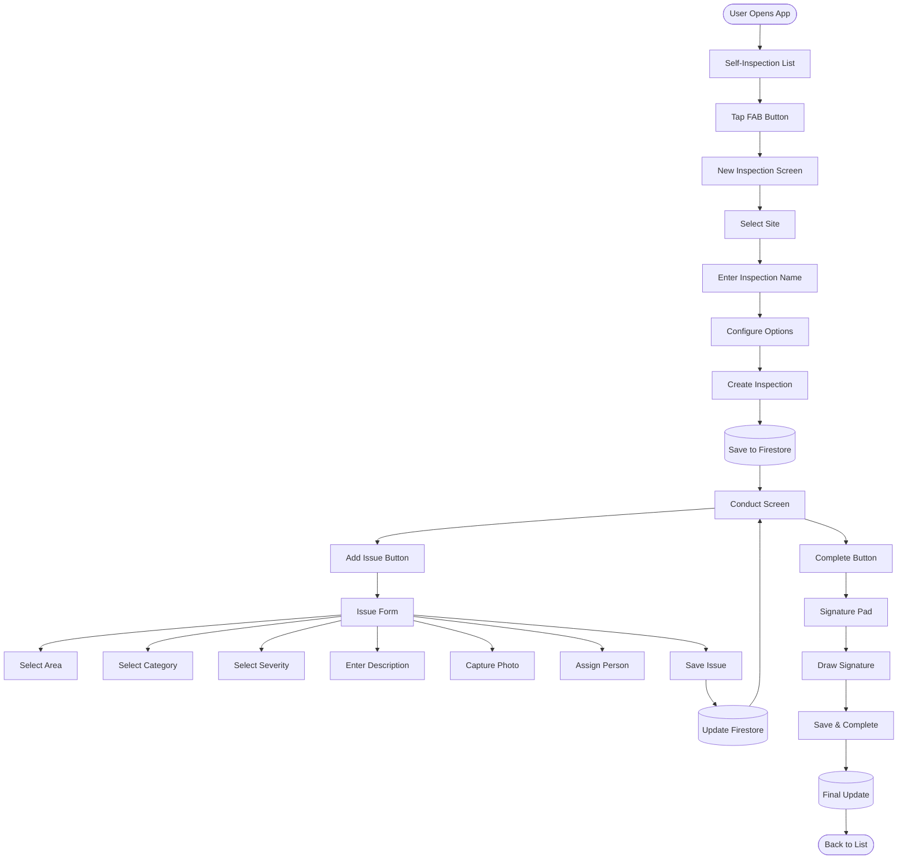
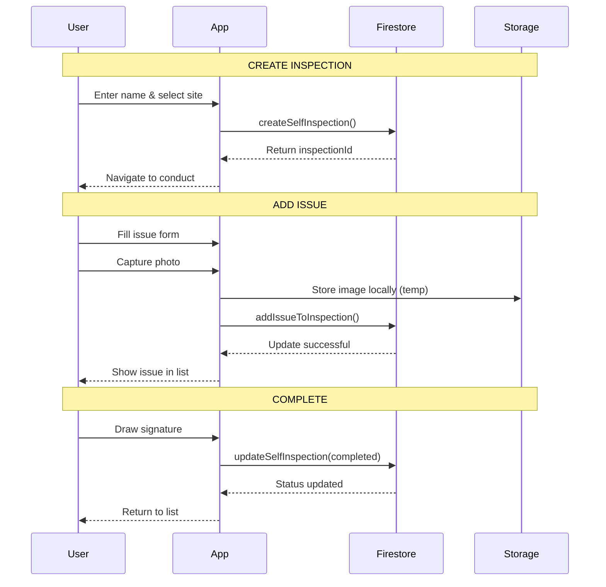
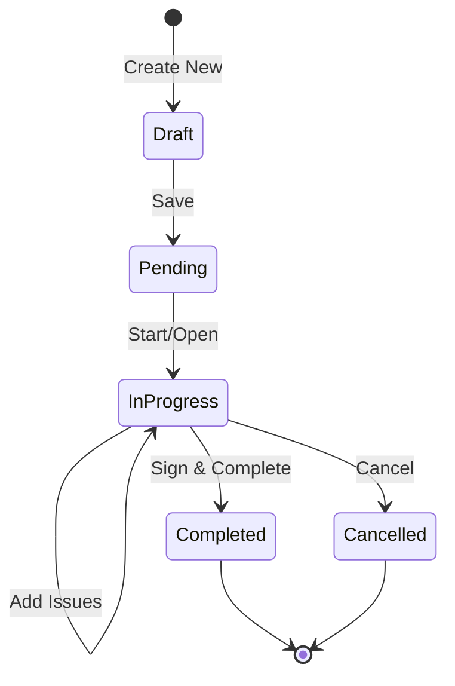

# Self-Inspection Complete Flow Documentation

## 🎯 Overview
End-to-end flow from creating a new self-inspection to completion with all data persisted to Firestore.

## 📊 High-Level Flow Diagram



## 🔄 Detailed Screen Flow

### 1️⃣ Self-Inspection List Screen
```
┌─────────────────────────────────┐
│  📋 Self Inspections            │
│  ━━━━━━━━━━━━━━━━━━━━━━━━━━━   │
│                                  │
│  🔄 Sync Status: ✅ Synced      │
│                                  │
│  ┌────────────────────────┐     │
│  │ Daily Kitchen Check    │     │
│  │ Main Facility          │     │
│  │ 🟡 In Progress • 2 issues│    │
│  └────────────────────────┘     │
│                                  │
│  ┌────────────────────────┐     │
│  │ Weekly Deep Clean      │     │
│  │ Warehouse             │     │
│  │ ✅ Completed • 0 issues │     │
│  └────────────────────────┘     │
│                                  │
│         [ + New Inspection ]     │
└─────────────────────────────────┘
```

**Actions:**
- View existing inspections
- Tap to resume/view
- FAB to create new

### 2️⃣ New Inspection Creation
```
┌─────────────────────────────────┐
│  New Self Inspection            │
│  ━━━━━━━━━━━━━━━━━━━━━━━━━━━   │
│                                  │
│  Step 1: Select Site            │
│  ○ Main Facility                │
│  ● Warehouse                    │
│  ○ Distribution Center          │
│                                  │
│  [ Continue ]                   │
└─────────────────────────────────┘
                ↓
┌─────────────────────────────────┐
│  Step 2: Inspection Details     │
│  ━━━━━━━━━━━━━━━━━━━━━━━━━━━   │
│                                  │
│  Name: [Daily Safety Check   ]  │
│                                  │
│  ☑ Raise NCRs                  │
│  ☑ Capture Before/After Photos │
│                                  │
│  [ Start Inspection ]           │
└─────────────────────────────────┘
```

### 3️⃣ Conduct Inspection Screen
```
┌─────────────────────────────────┐
│  Daily Safety Check             │
│  Warehouse                      │
│  ━━━━━━━━━━━━━━━━━━━━━━━━━━━   │
│                                  │
│  📊 Progress Summary            │
│  ┌──────────────┬──────────┐   │
│  │ Total Areas  │ Issues    │   │
│  │      8       │     2     │   │
│  └──────────────┴──────────┘   │
│                                  │
│  📝 Issues Found:               │
│  ┌────────────────────────┐     │
│  │ 🔴 Critical            │     │
│  │ Kitchen - Broken seal  │     │
│  │ John Doe • Due: Today  │     │
│  └────────────────────────┘     │
│                                  │
│  ┌────────────────────────┐     │
│  │ 🟡 Major               │     │
│  │ Storage - Temperature  │     │
│  │ Jane Smith • Tomorrow  │     │
│  └────────────────────────┘     │
│                                  │
│  [Complete Inspection]    [+]   │
└─────────────────────────────────┘
```

### 4️⃣ Add Issue Flow
```
┌─────────────────────────────────┐
│  Add Issue                      │
│  ━━━━━━━━━━━━━━━━━━━━━━━━━━━   │
│                                  │
│  Location: [Select Area ▼]      │
│  ┌────────────────────────┐     │
│  │ 🔍 Search areas...     │     │
│  │ ─────────────────────  │     │
│  │ ○ Kitchen              │     │
│  │ ○ Storage Room         │     │
│  │ ● Freezer              │     │
│  │ ○ Loading Dock         │     │
│  └────────────────────────┘     │
│                                  │
│  Category: [Equipment ▼]        │
│  Severity: [Critical ▼]         │
│                                  │
│  Description:                   │
│  [Freezer door seal broken,  ]  │
│  [causing temperature issue   ]  │
│                                  │
│  📸 Evidence: [Capture Photo]   │
│                                  │
│  Assign to: [John Doe ▼]        │
│  Due Date: [Tomorrow ]          │
│                                  │
│  [ Save Issue ]                 │
└─────────────────────────────────┘
```

### 5️⃣ Signature & Completion
```
┌─────────────────────────────────┐
│  Complete Inspection            │
│  ━━━━━━━━━━━━━━━━━━━━━━━━━━━   │
│                                  │
│  Summary:                       │
│  • 8 areas inspected           │
│  • 2 issues found              │
│  • Duration: 45 minutes        │
│                                  │
│  Inspector Signature:          │
│  ┌────────────────────────┐     │
│  │                        │     │
│  │      ___________       │     │
│  │     /           \      │     │
│  │    (_ John Doe _)      │     │
│  │                        │     │
│  └────────────────────────┘     │
│                                  │
│  [ Clear ]  [ Save & Complete ] │
└─────────────────────────────────┘
```

## 💾 Data Persistence Flow



## 🗄️ Firestore Data Structure

```javascript
// Path: companies/{companyId}/selfInspections/{inspectionId}
{
  "id": "insp_123456",
  "name": "Daily Safety Check",
  "site": "Warehouse",
  "siteId": "site_001",
  "checklist": "Standard Self-Inspection",
  "status": "completed",
  "totalItems": 80,
  "completedItems": 80,
  "issues": [
    {
      "id": "issue_1234_abc",
      "areaId": "area_freezer",
      "areaName": "Freezer",
      "category": "Equipment",
      "categoryId": "cat_equip",
      "severity": "Critical",
      "severityId": "sev_001",
      "severityLevel": 1,
      "description": "Freezer door seal broken",
      "images": [
        {
          "uri": "local://temp/image1.jpg",
          "annotations": [],
          "uploadedAt": "2024-01-15T10:30:00Z"
        }
      ],
      "proposedActionDate": "2024-01-16",
      "responsibleUserId": "user_john",
      "responsibleUserName": "John Doe",
      "status": "pending",
      "createdAt": "2024-01-15T10:30:00Z",
      "createdBy": "user_inspector",
      "createdByName": "Inspector Name",
      "acknowledged": false
    }
  ],
  "issueCount": 2,
  "createdAt": "2024-01-15T09:00:00Z",
  "updatedAt": "2024-01-15T10:45:00Z",
  "scheduledDate": "2024-01-15",
  "startedAt": "2024-01-15T09:00:00Z",
  "completedAt": "2024-01-15T10:45:00Z",
  "createdBy": "user_inspector",
  "createdByName": "Inspector Name",
  "completedBy": "user_inspector",
  "completedByName": "Inspector Name",
  "inspectorSignature": "data:image/png;base64,iVBORw0KG...",
  "signedAt": "2024-01-15T10:45:00Z",
  "companyId": "2XTSaqxU41zCTBIVJeXb"
}
```

## 🔄 State Transitions



## 📱 Navigation Flow

```mermaid
graph LR
    A[/self-inspection] --> B[/self-inspection/new]
    B --> C[/self-inspection/conduct]
    C --> D[/self-inspection/add-issue]
    D --> C
    C --> E[SignatureModal]
    E --> A
    
    A --> F[/self-inspection/dashboard]
    A --> C
```

## ⚡ Key User Actions & Data Updates

| User Action | Screen | Firestore Update | Local State |
|------------|--------|-----------------|-------------|
| Tap "New Inspection" | List | - | - |
| Select Site | New | - | selectedSite |
| Enter Name | New | - | inspectionName |
| Start Inspection | New | CREATE document | inspectionId |
| Add Issue | Conduct | - | Navigate |
| Select Area | Add Issue | - | selectedArea |
| Save Issue | Add Issue | UPDATE issues[] | issues array |
| Return to Conduct | Conduct | - | Refresh issues |
| Complete | Conduct | - | Show signature |
| Sign & Save | Signature | UPDATE status | - |
| Back to List | List | - | Refresh list |

## 🚨 Error Handling Points

1. **No Sites Available** → Show empty state with message
2. **Empty Inspection Name** → Validation alert
3. **No Areas for Site** → Need to seed data
4. **Image Upload Fails** → Queue for retry
5. **Offline Mode** → Queue all operations
6. **Signature Required** → Block completion

## ✅ Success Criteria

- User can create inspection with custom name
- All areas included by default (no selection)
- Issues persist immediately to Firestore
- Issues show area location
- Inspection completes with signature
- Data viewable in Firestore console
- Can resume in-progress inspections

## 🔮 Future Enhancements

1. **Offline Mode** - Queue operations when no internet
2. **Image Upload** - Firebase Storage integration
3. **Push Notifications** - Alert responsible persons
4. **Reports** - Generate PDF reports
5. **Analytics** - Track common issues by area