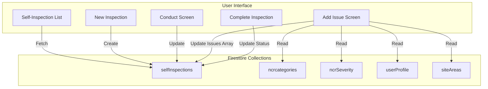
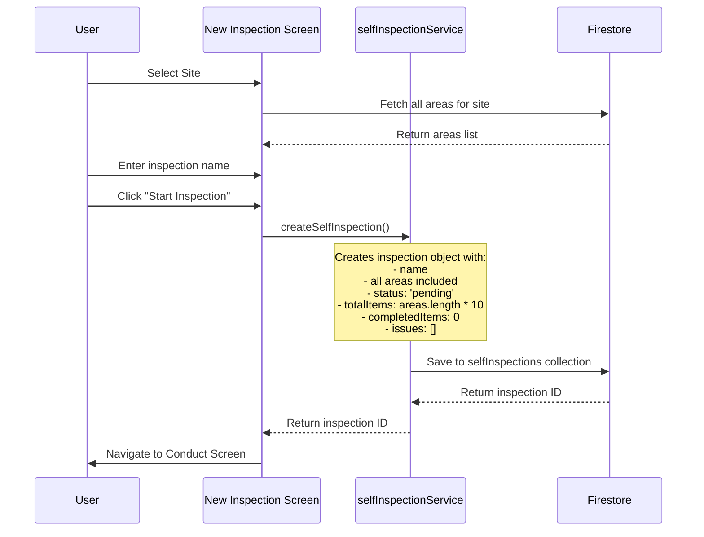
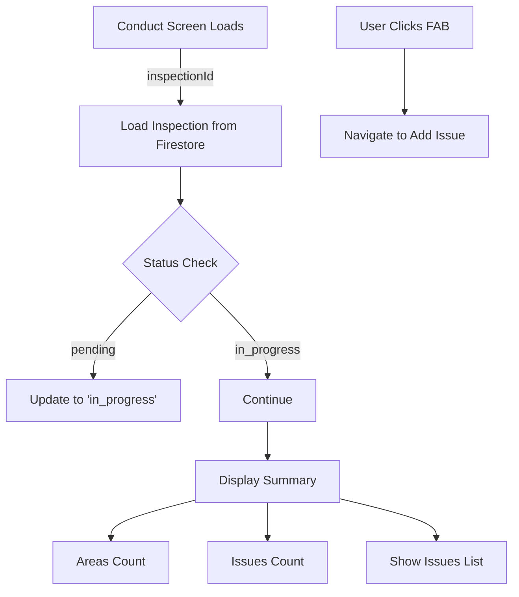
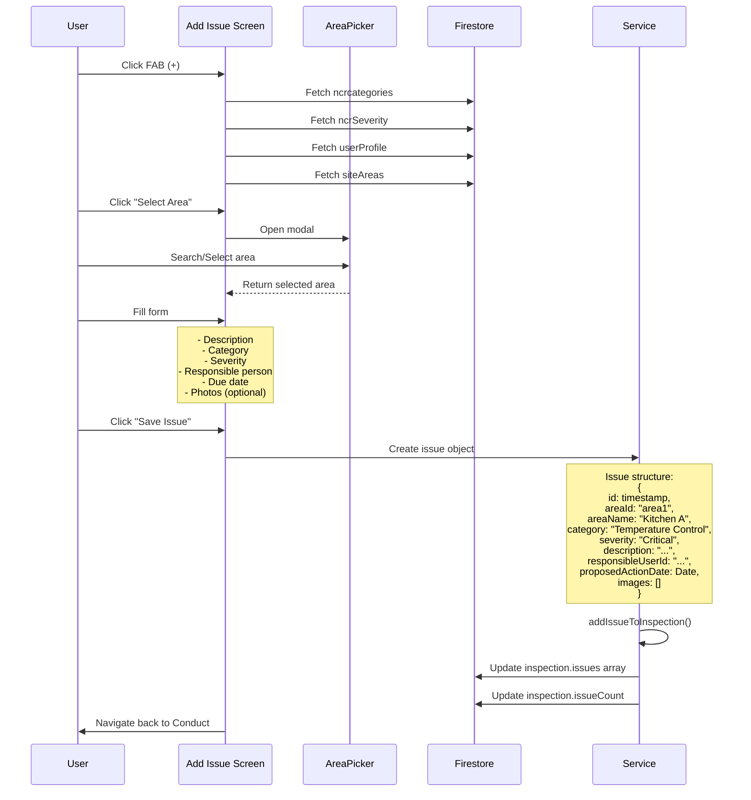
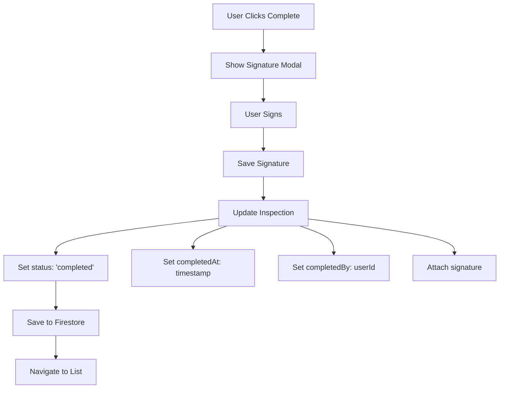
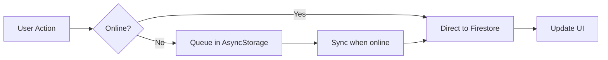

# Self-Inspection End-to-End Flow

## Overview
The self-inspection feature allows users to conduct inspections, report issues, and track compliance. All data is immediately persisted to Firestore to prevent data loss.

## 1. Data Flow Architecture



## 2. Creating a New Inspection



### Key Points:
- **Immediate Persistence**: Inspection is saved to Firestore BEFORE navigating
- **All Areas Included**: No area selection needed - all areas are automatically included
- **Unique ID**: Each inspection gets a Firestore-generated ID for tracking

## 3. Conducting an Inspection



### Data Structure in Firestore:
```javascript
{
  id: "abc123",
  name: "Jan 15 2pm - Kitchen Inspection",
  status: "in_progress",
  
  // Areas
  area: "Kitchen A, Storage Room, Prep Area",
  areaId: "area1,area2,area3",
  site: "Main Site",
  siteId: "site123",
  
  // Progress
  totalItems: 30,  // 3 areas × 10 items
  completedItems: 0,
  
  // Issues (array that grows as issues are added)
  issues: [],
  issueCount: 0,
  
  // Timestamps
  createdAt: Timestamp,
  updatedAt: Timestamp,
  scheduledDate: Date,
  startedAt: Timestamp,
  
  // User info
  createdBy: "userId",
  createdByName: "John Doe",
  companyId: "2XTSaqxU41zCTBIVJeXb"
}
```

## 4. Adding Issues



### Issue Persistence Strategy:
1. **Issue is created as an object** with all details
2. **Added to inspection's issues array** in Firestore
3. **Issue count is incremented** for quick reference
4. **Each issue includes area information** for context

## 5. Issue Data Structure

```javascript
{
  id: "1234567890",  // Timestamp-based ID
  
  // Location
  areaId: "kitchen-a",
  areaName: "Kitchen A",
  
  // Classification
  category: "Temperature Control",
  categoryId: "temperature-control",
  severity: "Critical",
  severityId: "critical",
  severityLevel: 1,
  
  // Details
  description: "Refrigerator temperature above safe zone",
  
  // Assignment
  responsibleUserId: "user123",
  responsibleUserName: "Jane Smith",
  proposedActionDate: Date,
  
  // Evidence
  images: [
    {
      uri: "file://...",
      annotations: [],
      type: "before",
      uploadedAt: Date
    }
  ],
  
  // Status
  status: "pending",
  acknowledged: false,
  
  // Metadata
  createdBy: "inspector123",
  createdByName: "John Doe",
  createdAt: Date
}
```

## 6. Completing an Inspection



## 7. Data Persistence Timeline

```mermaid
gantt
    title Data Persistence Points
    dateFormat X
    axisFormat %s
    
    section Inspection
    Create Inspection    :done, 0, 1
    Start (pending→progress) :done, 2, 1
    
    section Issues
    Add Issue 1          :done, 3, 1
    Add Issue 2          :done, 5, 1
    Add Issue 3          :done, 7, 1
    
    section Completion
    Complete & Sign      :done, 9, 1
    Final Save          :done, 10, 1
```



## 8. Offline Capability (Future)

The current architecture supports offline capability:



## Key Design Decisions

### 1. **Immediate Persistence**
- Inspection created immediately when starting
- No risk of data loss
- Can resume anytime

### 2. **Area Selection at Issue Level**
- All areas included by default
- Area selected only when adding issue
- Reduces complexity and clicks

### 3. **Issues as Array**
- Issues stored in inspection document
- No separate collection needed
- Easier to query and display

### 4. **Status Tracking**
```
draft → pending → in_progress → completed
```

### 5. **No Area Navigation**
- Simplified conduct screen
- All issues shown in one list
- Area shown as badge on each issue

## API Functions

```typescript
// Create new inspection
createSelfInspection(data, companyId) → inspectionId

// Update inspection
updateSelfInspection(inspectionId, updates, companyId)

// Add issue to inspection
addIssueToInspection(inspectionId, issue, companyId)

// Get all inspections
getSelfInspections(companyId, filterStatus?)

// Get single inspection
getSelfInspection(inspectionId, companyId)

// Mark as started
startInspection(inspectionId, companyId)

// Mark as completed
completeInspection(inspectionId, userId, userName, companyId)
```

## Benefits of This Architecture

1. **Data Safety**: Every action is persisted immediately
2. **Resumability**: Can pick up where left off anytime
3. **Simplicity**: Fewer screens and clicks
4. **Scalability**: Ready for offline mode
5. **Traceability**: Complete audit trail
6. **Performance**: Single document updates vs. multiple collections