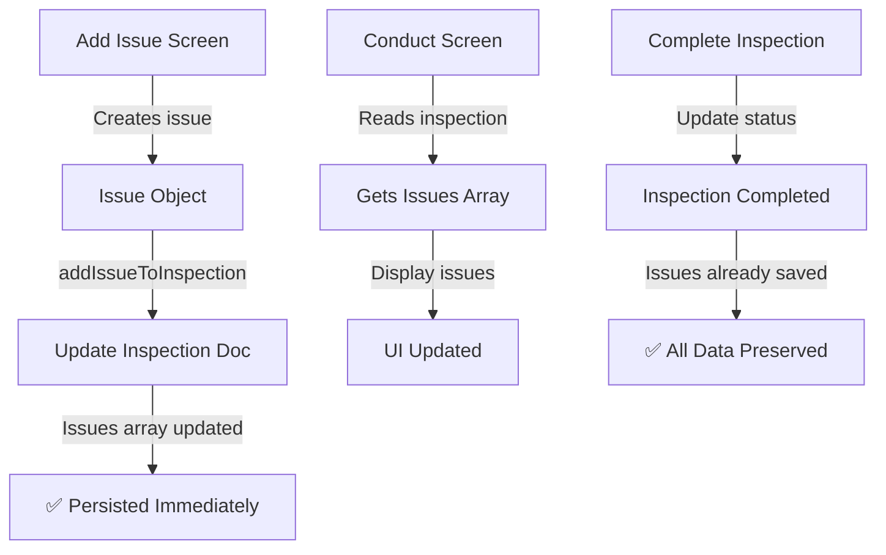

# Self-Inspection Model Alignment Issues

## Current Problems

### 1. **Issue Persistence Not Working**
- `add-issue.tsx` creates issue object but **NEVER saves to Firestore**
- Just creates the object and navigates back
- Issues are lost if app crashes

### 2. **Conflicting Storage Patterns**
- `selfInspectionService.ts`: Issues stored as **embedded array** in inspection document
- `conduct.tsx` (line 166): Issues saved as **subcollection** when completing
- No consistency on where issues actually live

### 3. **Data Model Confusion**
```typescript
// Current SelfInspection interface shows embedded issues:
interface SelfInspection {
  issues: any[];  // Embedded array
  issueCount: number;
}

// But conduct.tsx saves as subcollection:
collection(db, `companies/${companyId}/self_inspections/${inspectionRef.id}/issues`)
```

## Proposed Aligned Structure

### Option 1: Embedded Issues (Recommended for <100 issues per inspection)
```typescript
companies/
├── {companyId}/
│   └── selfInspections/
│       └── {inspectionId}/
│           ├── name: string
│           ├── issues: Issue[]  // Embedded array
│           ├── issueCount: number
│           └── ... other fields
```

**Pros:**
- Single document read gets everything
- Atomic updates
- Simpler queries

**Cons:**
- Document size limit (1MB)
- Can't query individual issues across inspections

### Option 2: Subcollection Issues (Better for scale)
```typescript
companies/
├── {companyId}/
│   └── selfInspections/
│       └── {inspectionId}/
│           ├── name: string
│           ├── issueCount: number  // Denormalized count
│           └── issues/  // Subcollection
│               └── {issueId}/
│                   ├── description: string
│                   ├── severity: string
│                   └── ... issue fields
```

**Pros:**
- No document size limits
- Can query issues across inspections
- Better for analytics

**Cons:**
- Multiple reads needed
- More complex updates

## Recommended Fix

Given the HACCP context where inspections typically have 10-50 issues max, **Option 1 (Embedded)** is recommended.

### Implementation Changes Needed:

1. **Fix add-issue.tsx** to actually persist:
```typescript
// After creating issue object
await addIssueToInspection(inspectionId, issue, companyId);
```

2. **Remove subcollection logic from conduct.tsx**:
```typescript
// Remove lines 166-172 that save to subcollection
// Issues are already in the inspection document
```

3. **Update service to handle issue IDs properly**:
```typescript
const issue = {
  id: `issue_${Date.now()}_${Math.random().toString(36).substr(2, 9)}`,
  // ... rest of issue
};
```

4. **Add proper TypeScript interface**:
```typescript
export interface Issue {
  id: string;
  areaId: string;
  areaName: string;
  category: string;
  categoryId: string;
  severity: string;
  severityId: string;
  severityLevel: number;
  description: string;
  images: ImageData[];
  proposedActionDate: Date;
  responsibleUserId: string;
  responsibleUserName: string;
  status: 'pending' | 'in_progress' | 'resolved' | 'closed';
  createdAt: Date;
  createdBy: string;
  createdByName: string;
  acknowledged: boolean;
  acknowledgedAt?: Date;
  acknowledgedBy?: string;
}
```

## Current Data Flow (BROKEN)

```mermaid
graph TD
    A[Add Issue Screen] -->|Creates issue object| B[Issue Object]
    B -->|Navigation.back()| C[Returns to Conduct]
    C -->|Issue is LOST| D[❌ Never Saved]
    
    E[Complete Inspection] -->|Tries to save| F[Subcollection]
    F -->|But issues array empty| G[❌ No Issues Saved]
```

## Fixed Data Flow



## Migration Path

1. First, fix the immediate issue persistence bug
2. Clean up the conduct.tsx subcollection code
3. If needed later, migrate to subcollections when scale demands it
4. For now, embedded array is simpler and sufficient