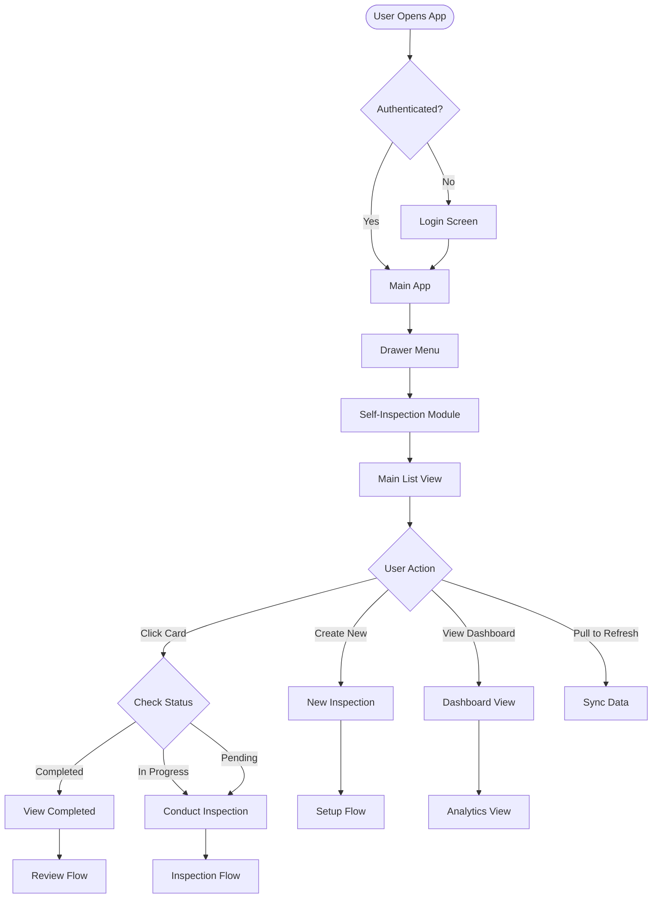
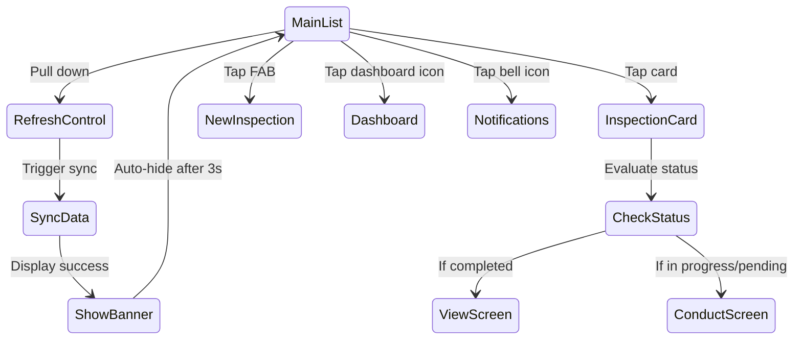
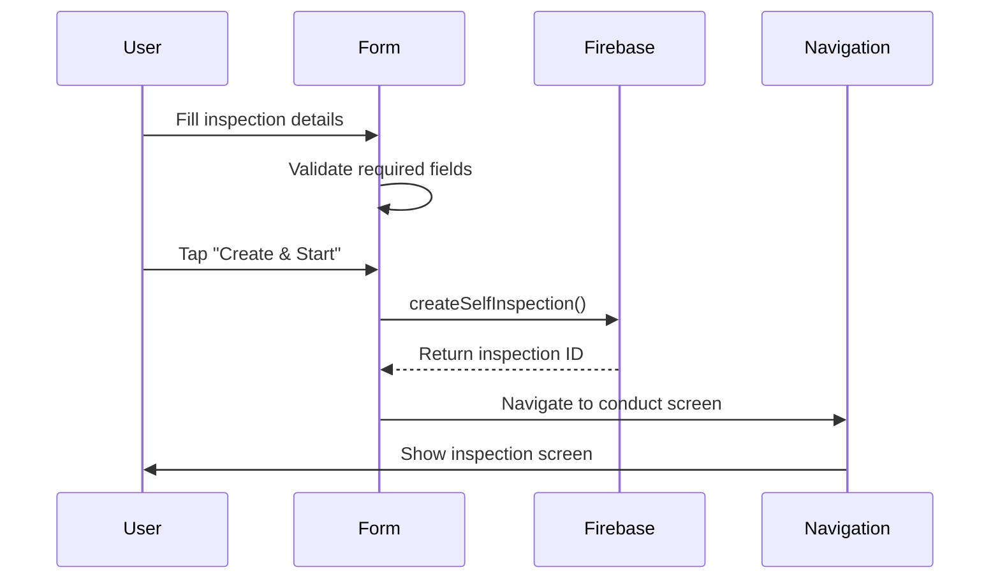
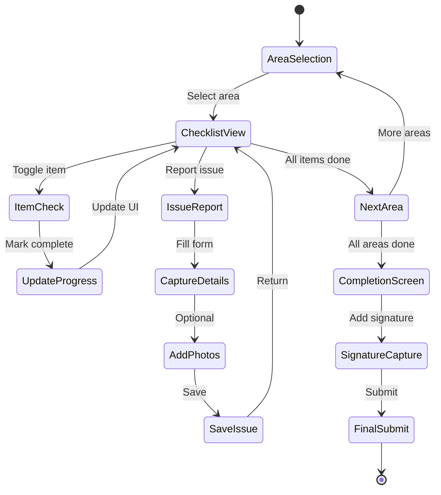
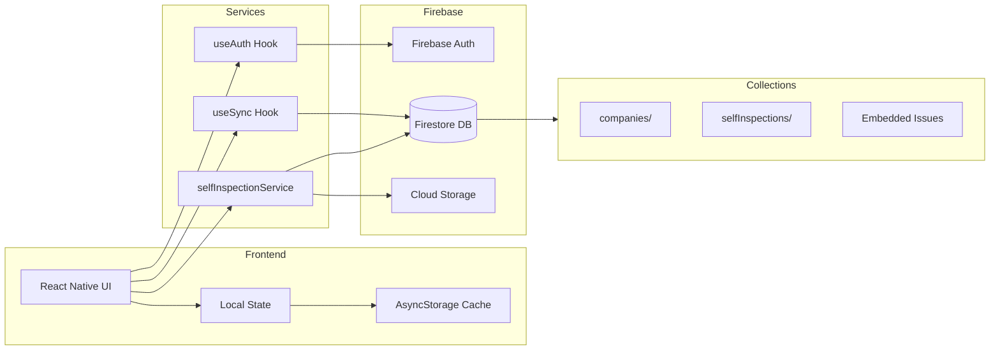
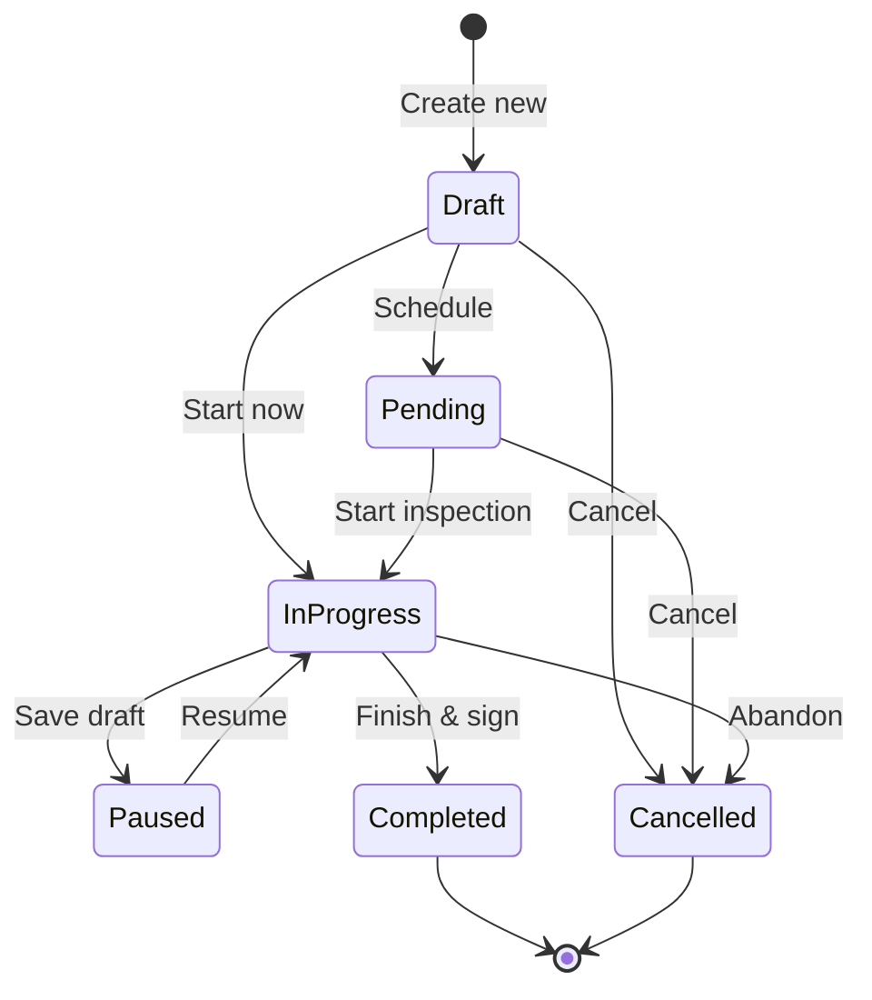

# Self-Inspection Feature - Complete Visual Flow Diagram

## 🎯 Feature Overview
The Self-Inspection module enables daily operational checks and compliance inspections with real-time issue tracking, photo documentation, and progress monitoring.

## 📊 Complete User Journey Flow



## 📱 Page 1: Main List Screen (`/self-inspection`)

### Visual Layout
```
┌──────────────────────────────────┐
│  🔄 Self Inspections        🔔 📊 │ 
│  Complete daily checks           │
│  Last synced: 2:34 PM           │
├──────────────────────────────────┤
│                                  │
│  ┌────────────────────────────┐ │
│  │ 📋 Self Inspection         │ │
│  │ Envirowize Plant A      🟢 │ │
│  │ Daily Checklist         ●  │ │
│  │ ████████░░ 8/10 items   │ │
│  │ ⚠️ 2 issues found         │ │
│  │ 🕐 Today, 9:00 AM        │ │
│  │ 👤 John Smith            │ │
│  └────────────────────────────┘ │
│                                  │
│  ┌────────────────────────────┐ │
│  │ 📋 Self Inspection         │ │
│  │ Envirowize Plant B      🟡 │ │
│  │ Weekly Audit           ●  │ │
│  │ ███░░░░░░░ 3/10 items   │ │
│  │ ⚠️ 0 issues found         │ │
│  │ 🕐 Yesterday              │ │
│  │ 👤 Jane Doe              │ │
│  └────────────────────────────┘ │
│                                  │
│         [+] New Inspection       │
└──────────────────────────────────┘
```

### Component Details
- **Header Section**:
  - Title: "Self Inspections"
  - Subtitle: "Complete daily checks and inspections"
  - Sync status with timestamp
  - Action buttons: Sync (🔄), Notifications (🔔), Dashboard (📊)

- **Inspection Cards**:
  - Status indicator colors:
    - 🟢 Completed (primary color)
    - 🟡 In Progress (tertiary color)
    - 🔴 Pending (secondary color)
    - ⚫ Draft (outline color)
  - Progress bar showing completion
  - Issue count with warning icon
  - Scheduled date/time
  - Assigned user name

### User Interactions


## 📱 Page 2: New Inspection Creation (`/self-inspection/new`)

### Visual Flow
```
┌──────────────────────────────────┐
│  ← New Self Inspection          │
├──────────────────────────────────┤
│                                  │
│  Step 1: Basic Information      │
│  ┌────────────────────────────┐ │
│  │ Inspection Name*            │ │
│  │ [Daily Kitchen Check    ]   │ │
│  └────────────────────────────┘ │
│                                  │
│  ┌────────────────────────────┐ │
│  │ Select Site*               │ │
│  │ [▼ Envirowize Plant A   ]   │ │
│  └────────────────────────────┘ │
│                                  │
│  ┌────────────────────────────┐ │
│  │ Select Checklist*          │ │
│  │ [▼ Daily Inspection     ]   │ │
│  └────────────────────────────┘ │
│                                  │
│  ┌────────────────────────────┐ │
│  │ Schedule Date & Time       │ │
│  │ [📅 Today, 9:00 AM      ]   │ │
│  └────────────────────────────┘ │
│                                  │
│  ┌────────────────────────────┐ │
│  │ Assign To                  │ │
│  │ [▼ John Smith           ]   │ │
│  └────────────────────────────┘ │
│                                  │
│  [Cancel]      [Create & Start]  │
└──────────────────────────────────┘
```

### Data Flow


## 📱 Page 3: Conduct Inspection (`/self-inspection/conduct`)

### Multi-Screen Flow
```
Screen 3A: Area Selection
┌──────────────────────────────────┐
│  ← Daily Kitchen Check          │
│     Progress: 0/15 items        │
├──────────────────────────────────┤
│  Select Area to Inspect:        │
│                                  │
│  ┌────────────────────────────┐ │
│  │ 🏭 Production Area         │ │
│  │ 12 checkpoints      ✓ 0/12 │ │
│  └────────────────────────────┘ │
│                                  │
│  ┌────────────────────────────┐ │
│  │ 🍴 Kitchen                 │ │
│  │ 8 checkpoints       ✓ 2/8  │ │
│  └────────────────────────────┘ │
│                                  │
│  ┌────────────────────────────┐ │
│  │ 📦 Storage Area            │ │
│  │ 5 checkpoints       ✓ 0/5  │ │
│  └────────────────────────────┘ │
│                                  │
│  [Save Draft]    [Complete All]  │
└──────────────────────────────────┘

Screen 3B: Checklist Items
┌──────────────────────────────────┐
│  ← Kitchen - Daily Check        │
│     Area Progress: 2/8          │
├──────────────────────────────────┤
│                                  │
│  ☑️ Floor clean and dry          │
│  ☑️ Equipment sanitized          │
│  ☐ Temperature logs complete    │
│  ☐ Hand washing stations OK     │
│  ☐ Waste properly disposed      │
│  ☐ Pest control measures OK     │
│  ☐ Food storage correct         │
│  ☐ Cross contamination controls │
│                                  │
│  [Report Issue]  [Next Area →]   │
└──────────────────────────────────┘

Screen 3C: Issue Reporting
┌──────────────────────────────────┐
│  ← Report Issue                 │
│     Kitchen - Item #4           │
├──────────────────────────────────┤
│  Issue Category*                │
│  [▼ Hygiene               ]     │
│                                  │
│  Severity Level*                │
│  [▼ Major                 ]     │
│                                  │
│  Description*                   │
│  ┌────────────────────────────┐ │
│  │ No soap in dispenser.     │ │
│  │ Staff unable to wash      │ │
│  │ hands properly.            │ │
│  └────────────────────────────┘ │
│                                  │
│  📷 Add Photos (0/5)            │
│  ┌────┬────┬────┬────┬────┐   │
│  │ +  │    │    │    │    │   │
│  └────┴────┴────┴────┴────┘   │
│                                  │
│  Responsible Person*            │
│  [▼ Mike Johnson          ]     │
│                                  │
│  Target Resolution Date*        │
│  [📅 Tomorrow, 5:00 PM    ]     │
│                                  │
│  [Cancel]        [Save Issue]   │
└──────────────────────────────────┘
```

### State Management


## 📱 Page 4: Dashboard Analytics (`/self-inspection/dashboard`)

### Visual Layout
```
┌──────────────────────────────────┐
│  ← Inspection Dashboard         │
├──────────────────────────────────┤
│  Period: [Last 30 Days ▼]       │
│                                  │
│  ┌────────────────────────────┐ │
│  │ Completion Rate             │ │
│  │ ████████████░░ 85%         │ │
│  │ 34 of 40 completed          │ │
│  └────────────────────────────┘ │
│                                  │
│  ┌────────────────────────────┐ │
│  │ Issues by Severity          │ │
│  │ 🔴 Critical: 2              │ │
│  │ 🟡 Major: 8                 │ │
│  │ 🟢 Minor: 15                │ │
│  └────────────────────────────┘ │
│                                  │
│  ┌────────────────────────────┐ │
│  │ Trend Chart                 │ │
│  │     📈                      │ │
│  │    ╱  ╲    ╱╲              │ │
│  │   ╱    ╲__╱  ╲             │ │
│  │  ╱            ╲            │ │
│  └────────────────────────────┘ │
│                                  │
│  Top Issues This Month:         │
│  • Hand washing stations (5)    │
│  • Temperature logs (4)         │
│  • Equipment cleaning (3)       │
└──────────────────────────────────┘
```

## 📱 Page 5: View Completed Inspection (`/self-inspection/view`)

### Report View
```
┌──────────────────────────────────┐
│  ← Inspection Report            │
│     Completed: Oct 24, 2024     │
├──────────────────────────────────┤
│  Daily Kitchen Check            │
│  Envirowize Plant A             │
│                                  │
│  Inspector: John Smith          │
│  Duration: 45 minutes           │
│  Score: 85/100                  │
│                                  │
│  ┌────────────────────────────┐ │
│  │ Areas Inspected:           │ │
│  │ ✅ Production (10/10)       │ │
│  │ ⚠️ Kitchen (6/8)           │ │
│  │ ✅ Storage (5/5)            │ │
│  └────────────────────────────┘ │
│                                  │
│  Issues Found (2):              │
│  ┌────────────────────────────┐ │
│  │ 🟡 No soap in dispenser    │ │
│  │ Kitchen - Major            │ │
│  │ Assigned: Mike Johnson     │ │
│  │ Due: Oct 25, 5:00 PM       │ │
│  │ [View Photos]              │ │
│  └────────────────────────────┘ │
│                                  │
│  ┌────────────────────────────┐ │
│  │ Inspector Signature:       │ │
│  │ [Signature Image]          │ │
│  │ John Smith                 │ │
│  │ Oct 24, 2024 2:45 PM       │ │
│  └────────────────────────────┘ │
│                                  │
│  [📥 Export PDF]  [📧 Email]    │
└──────────────────────────────────┘
```

## 🔄 Complete Data Flow Architecture



## 📊 Status Lifecycle



## 🎨 UI Component Hierarchy

```
SelfInspectionScreen
├── Surface (Header)
│   ├── Text (Title/Subtitle)
│   ├── IconButton (Sync)
│   ├── NotificationBell
│   └── IconButton (Dashboard)
├── ScrollView
│   ├── RefreshControl
│   ├── Banner (Sync Status)
│   └── InspectionCards[]
│       ├── Avatar.Icon
│       ├── Text (Name/Site)
│       ├── Chip (Status)
│       ├── ProgressBar
│       └── Footer Info
└── FAB (New Inspection)
```

## 🔔 Key Features & Interactions

1. **Real-time Sync**: Pull-to-refresh syncs with Firestore
2. **Offline Support**: Caches data locally, syncs when online
3. **Photo Documentation**: Up to 5 photos per issue with annotations
4. **Digital Signatures**: Capture inspector signature on completion
5. **Issue Tracking**: Embedded issues with severity levels
6. **Progress Tracking**: Visual progress bars and completion stats
7. **Multi-area Support**: Inspect different areas independently
8. **Draft Saving**: Save progress and resume later
9. **Assignment System**: Assign to specific users
10. **Export Options**: Generate PDF reports, email results

## 📱 Navigation Stack

```
Root Navigator
└── Drawer Navigator
    └── Self Inspection Tab
        ├── Main List Screen
        ├── New Inspection Modal
        ├── Conduct Inspection Stack
        │   ├── Area Selection
        │   ├── Checklist View
        │   ├── Issue Report Modal
        │   └── Signature Capture
        ├── View Completed Screen
        └── Dashboard Analytics
```