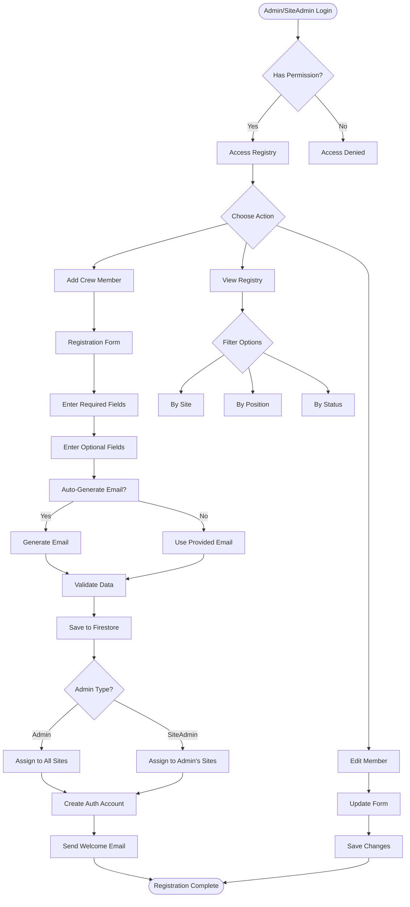
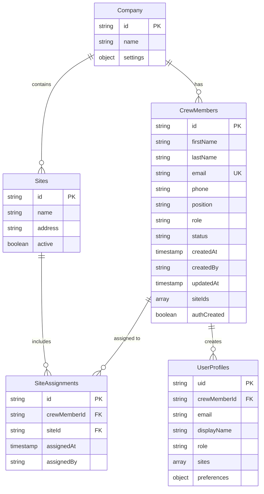
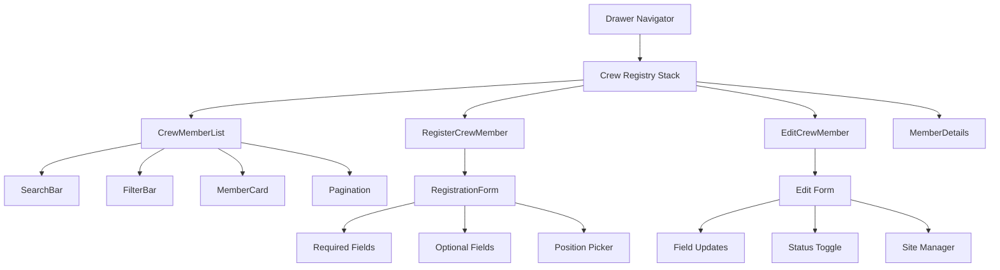
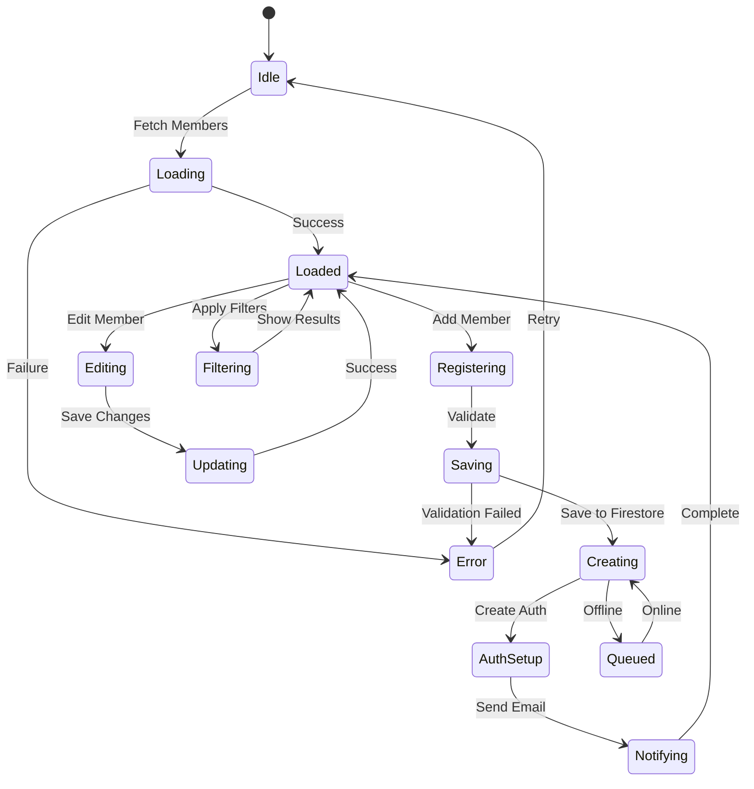

# Crew Member Registry Feature Plan

## Feature Overview

The Crew Member Registry is a lightweight mobile-first system for admins and site admins to register crew members who will participate in training and certification programs. This system enables quick field registration without requiring extensive data entry, focusing on capturing essential information while deferring detailed training requirements to future role-based configuration.

### User Flow Diagram



## Technical Requirements

### Platform Support
- **Primary**: React Native Mobile (iOS/Android)
- **Secondary**: Web support (responsive design)
- **Offline**: Queue registrations for sync when online

### Authentication & Authorization
- Only `admin` and `siteAdmin` roles can access the registry
- Crew members receive `crewMember` role upon registration
- Firebase Auth for account creation
- Role-based navigation guards

### Data Validation
- Email format validation (when provided)
- Duplicate email checking
- Required field validation
- Phone number format validation (optional)

### Performance Requirements
- List view pagination (20 members per page)
- Search debounce (300ms)
- Lazy loading for large datasets
- Optimistic UI updates

## Data Models/Collections

### Firestore Structure (CSC Pattern)



### Collection Paths
```typescript
// Using CSC (Company Scoped Collection) pattern
csc/crewMembers           // companies/${companyId}/crewMembers
csc/sites                 // companies/${companyId}/sites
csc/siteAssignments      // companies/${companyId}/siteAssignments
userProfiles             // Global collection for auth profiles
```

### CrewMember Document Schema
```typescript
interface CrewMember {
  id: string;
  firstName: string;
  lastName: string;
  email: string;
  phone?: string;
  position: PositionType;
  role: 'crewMember';
  status: 'active' | 'inactive' | 'pending';
  createdAt: Timestamp;
  createdBy: string; // Admin user ID
  updatedAt?: Timestamp;
  updatedBy?: string;
  siteIds: string[];
  authCreated: boolean;
  inviteSent?: boolean;
  inviteSentAt?: Timestamp;
  // Training fields (future implementation)
  trainingRequired?: boolean;
  certificationIds?: string[];
}
```

### Predefined Positions
```typescript
enum PositionType {
  // Kitchen Staff
  CHEF = 'Chef',
  SOUS_CHEF = 'Sous Chef',
  LINE_COOK = 'Line Cook',
  PREP_COOK = 'Prep Cook',
  PASTRY_CHEF = 'Pastry Chef',
  
  // Service Staff
  SERVER = 'Server',
  BARTENDER = 'Bartender',
  HOST = 'Host/Hostess',
  BUSSER = 'Busser',
  FOOD_RUNNER = 'Food Runner',
  
  // Management
  KITCHEN_MANAGER = 'Kitchen Manager',
  FLOOR_MANAGER = 'Floor Manager',
  SHIFT_SUPERVISOR = 'Shift Supervisor',
  
  // Support Staff
  DISHWASHER = 'Dishwasher',
  CLEANER = 'Cleaner',
  MAINTENANCE = 'Maintenance',
  RECEIVING = 'Receiving',
  
  // Specialized
  QUALITY_CONTROL = 'Quality Control',
  FOOD_SAFETY_LEAD = 'Food Safety Lead',
  TRAINER = 'Trainer',
  
  // Generic
  TEAM_MEMBER = 'Team Member',
  OTHER = 'Other'
}
```

## User Stories

### Admin User Stories
1. **As an admin**, I want to quickly register crew members from my mobile device so field registration is efficient
2. **As an admin**, I want the system to auto-generate emails when not provided so registration isn't blocked
3. **As an admin**, I want crew members automatically assigned to all company sites so I don't need manual assignments
4. **As an admin**, I want to view all crew members across all sites for oversight

### Site Admin User Stories
1. **As a site admin**, I want to register crew members for my sites only so I maintain site autonomy
2. **As a site admin**, I want to see only crew members assigned to my sites for focused management
3. **As a site admin**, I want to edit crew member details for my site's staff

### Crew Member User Stories
1. **As a crew member**, I want to receive login credentials after registration so I can access training
2. **As a crew member**, I want to see only training-related content when I log in
3. **As a crew member**, I want my profile to show my position and assigned sites

## Acceptance Criteria

### Registration Flow
- [ ] Admin can access crew registry from drawer navigation
- [ ] Registration form shows on mobile with proper keyboard handling
- [ ] Required fields: firstName, lastName, position
- [ ] Optional fields: email, phone
- [ ] Position dropdown shows predefined list
- [ ] Email auto-generation when not provided (format: firstname.lastname.XXXX@company.temp)
- [ ] Validation prevents duplicate emails
- [ ] Success message shows after registration
- [ ] New member appears in list immediately

### Site Assignment Logic
- [ ] Admin registrations assign to all company sites
- [ ] SiteAdmin registrations assign only to admin's sites
- [ ] Site assignments stored in both crewMembers.siteIds and siteAssignments collection
- [ ] Site list shows only assigned sites in member details

### Authentication Creation
- [ ] Firebase Auth account created upon successful registration
- [ ] Temporary password generated for new accounts
- [ ] Welcome email sent with login instructions (if real email)
- [ ] Auth creation failure doesn't block registration (queued for retry)

### List View & Search
- [ ] List shows crew members based on user's role/sites
- [ ] Search by name, email, position
- [ ] Filter by site (dropdown)
- [ ] Filter by position (multi-select)
- [ ] Filter by status (active/inactive/pending)
- [ ] Pagination loads 20 members at a time
- [ ] Pull-to-refresh updates list

### Edit Capabilities
- [ ] Admin can edit any crew member
- [ ] SiteAdmin can edit only their site's members
- [ ] Editable fields: name, email, phone, position, status
- [ ] Site assignments editable by admin only
- [ ] Changes sync immediately to Firestore

### Mobile Optimization
- [ ] Form fields properly sized for touch
- [ ] Keyboard doesn't cover input fields
- [ ] Dropdown/picker native to platform
- [ ] Swipe actions for quick edit/deactivate
- [ ] Responsive design for tablets

## Implementation Notes

### Phase 1: Core Registry (Week 1)
1. Create navigation entry in drawer
2. Build registration form component
3. Implement Firestore service for CRUD operations
4. Add email auto-generation logic
5. Create position dropdown/picker

### Phase 2: Site Assignment (Week 1)
1. Implement role detection for assignment logic
2. Create siteAssignments collection structure
3. Build site selection UI (admin only)
4. Add site filtering to list view

### Phase 3: Authentication (Week 2)
1. Integrate Firebase Auth account creation
2. Implement password generation
3. Create welcome email template
4. Add retry queue for failed auth creation
5. Handle auth errors gracefully

### Phase 4: List Management (Week 2)
1. Build crew member list with search
2. Implement filters (site, position, status)
3. Add pagination and infinite scroll
4. Create edit modal/screen
5. Add status management (active/inactive)

### Phase 5: Offline Support (Week 3)
1. Queue registrations in AsyncStorage
2. Implement sync manager
3. Handle conflict resolution
4. Show sync status indicators

## Visual Architecture

### Component Structure


### State Management


## Default Configurations

### Email Generation Pattern
```typescript
const generateEmail = (firstName: string, lastName: string, companyId: string): string => {
  const random = Math.floor(1000 + Math.random() * 9000);
  const domain = getCompanyDomain(companyId) || 'company.temp';
  return `${firstName.toLowerCase()}.${lastName.toLowerCase()}.${random}@${domain}`;
};
```

### Default Site Assignment
```typescript
const assignSites = async (memberId: string, adminRole: string, adminId: string) => {
  if (adminRole === 'admin') {
    // Assign to all company sites
    const sites = await getAllCompanySites();
    return sites.map(site => site.id);
  } else if (adminRole === 'siteAdmin') {
    // Assign to admin's sites only
    const adminProfile = await getUserProfile(adminId);
    return adminProfile.sites || [];
  }
  return [];
};
```

### Welcome Email Template
```html
Subject: Welcome to [Company Name] Training Platform

Hello [First Name],

Your training account has been created. You can now access the HACCP training platform.

Login Credentials:
Email: [Email]
Temporary Password: [Password]

Please log in and change your password at your first opportunity.

Access the platform at: [App URL]

Best regards,
[Company Name] Training Team
```

## Offline Strategy

### Registration Queue
```typescript
interface QueuedRegistration {
  id: string;
  data: CrewMember;
  timestamp: number;
  retryCount: number;
  error?: string;
}

// Store in AsyncStorage
AsyncStorage.setItem('queued_registrations', JSON.stringify(queue));
```

### Sync Process
1. Check network connectivity
2. Process queued registrations in order
3. Create Firestore documents
4. Create Auth accounts
5. Update local cache
6. Clear successful items from queue
7. Retry failed items with exponential backoff

### Conflict Resolution
- Email conflicts: Append timestamp to make unique
- Site assignment conflicts: Merge arrays, remove duplicates
- Status conflicts: Most recent update wins

## Web UI Requirements

### Responsive Design
- Mobile: Single column layout, full-width forms
- Tablet: Two-column layout for list/detail view
- Desktop: Three-panel layout with filters sidebar

### Web-Specific Features
- Bulk import via CSV upload
- Export crew list to Excel
- Print-friendly member cards
- Keyboard shortcuts for navigation
- Multi-select for bulk operations

### Browser Support
- Chrome 90+
- Safari 14+
- Firefox 88+
- Edge 90+

## Future Enhancements

### Training Integration (Phase 2)
- Link crew members to training modules
- Track certification expiration
- Assign role-based training requirements
- Generate training reports

### Advanced Features (Phase 3)
- Biometric sign-in for crew
- QR code badges for quick check-in
- Shift scheduling integration
- Performance tracking
- Document upload (certifications, ID)

### Analytics (Phase 4)
- Training completion rates by position
- Site compliance scores
- Crew retention metrics
- Certification expiration alerts

## Success Metrics

### Technical Metrics
- Registration time: < 30 seconds per member
- List load time: < 2 seconds for 100 members
- Search response: < 300ms
- Sync success rate: > 95%

### Business Metrics
- Crew member adoption rate
- Training completion improvement
- Time saved vs paper registration
- Reduction in compliance gaps

## Risk Mitigation

### Technical Risks
- **Auth creation failures**: Queue for retry, allow manual creation
- **Email delivery issues**: Show in-app credentials, allow resend
- **Offline data conflicts**: Clear conflict resolution rules
- **Performance degradation**: Implement pagination, lazy loading

### Business Risks
- **Low adoption**: Simplified UI, minimal required fields
- **Data privacy concerns**: Role-based access, audit logs
- **Training compliance**: Future integration with certification tracking

---

## Appendix

### Firebase Security Rules
```javascript
// Crew Members Collection
match /companies/{companyId}/crewMembers/{memberId} {
  allow read: if request.auth != null && 
    (isAdmin() || (isSiteAdmin() && memberBelongsToAdminSites()));
  allow create: if request.auth != null && 
    (isAdmin() || isSiteAdmin());
  allow update: if request.auth != null && 
    (isAdmin() || (isSiteAdmin() && memberBelongsToAdminSites()));
  allow delete: if request.auth != null && isAdmin();
}
```

### Sample API Endpoints (Future REST API)
```
POST   /api/crew-members          - Create new member
GET    /api/crew-members          - List members (filtered)
GET    /api/crew-members/:id      - Get member details
PUT    /api/crew-members/:id      - Update member
DELETE /api/crew-members/:id      - Deactivate member
POST   /api/crew-members/bulk     - Bulk import
GET    /api/crew-members/export   - Export to CSV
```

---

**Document Version**: 1.0
**Created**: 2025-08-25
**Status**: Ready for Implementation
**Sprint**: Not Scheduled
**Dependencies**: Firebase Auth, Firestore, Role-based navigation