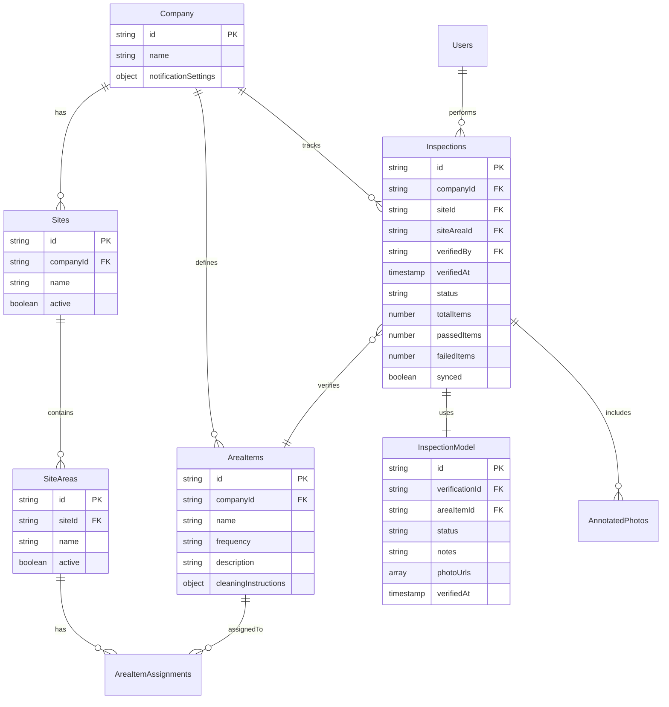
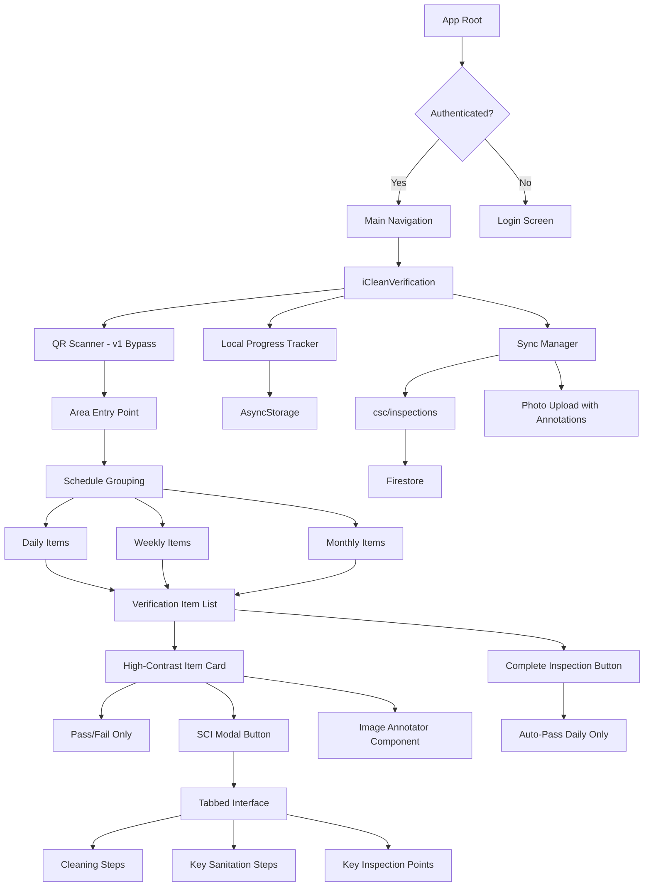

# iCleanVerification Feature Plan

## Feature Overview

iCleanVerification is a mobile-first cleaning verification system that enables siteAdmin users to systematically verify that cleaning tasks have been completed correctly across their facility. The feature provides offline capability, photo evidence capture with annotation overlay, and progressive local status tracking.

### CRITICAL REQUIREMENTS (Must Have)
1. **Status Options**: Only Pass/Fail - NO Partial or NA options
2. **Data Model**: Use existing InspectionModel interface from CLEANING_SYSTEM_INTERFACES.md
3. **Collection**: Persist to `csc/inspections` (company-scoped collection)
4. **Workflow**: siteAreas → Schedule Groups (Daily/Weekly/Monthly) → Progressive local tracking
5. **Complete Button**: Respects manual verifications, auto-passes ONLY remaining daily items
6. **Entry Point**: Area selection with QR code scanning (bypassable in v1)
7. **Photo Capture**: Must use existing ImageAnnotator overlay system
8. **SCI Modal**: User-friendly tabbed interface (Cleaning Steps | Key Sanitation | Inspection Points)
9. **Design**: Address white-cards contrast issue throughout the UI

### User Flow Diagram
```mermaid
flowchart TD
    Start([SiteAdmin Opens App]) --> SelectSite[Select Site]
    SelectSite --> QRScan{QR Code Available?}
    QRScan -->|Yes| ScanQR[Scan Area QR Code]
    QRScan -->|No - v1 bypass| LoadAreas[Load Site Areas]
    ScanQR --> LoadAreaFromQR[Load Area from QR]
    LoadAreas --> SelectArea[Select Area to Verify]
    LoadAreaFromQR --> GroupBySchedule[Group Items by Schedule]
    SelectArea --> GroupBySchedule
    
    GroupBySchedule --> DisplayGroups[Display: Daily/Weekly/Monthly Groups]
    DisplayGroups --> SelectGroup[Select Schedule Group]
    SelectGroup --> LoadItems[Load Items for Schedule]
    LoadItems --> VerifyItem{Verify Each Item}
    
    VerifyItem --> ViewSCI{View SCI?}
    ViewSCI -->|Yes| OpenModal[Open SCI Modal with Tabs]
    ViewSCI -->|No| SetStatus
    OpenModal --> Tabs[Cleaning Steps | Key Sanitation | Inspection Points]
    Tabs --> SetStatus[Set Status: Pass/Fail]
    
    SetStatus --> Photo{Capture Photo?}
    Photo -->|Yes| TakePhoto[Take Photo with Annotation Overlay]
    Photo -->|No| SaveLocal[Save Status Locally]
    TakePhoto --> SaveLocal
    
    SaveLocal --> NextCheck{More Items?}
    NextCheck -->|Yes| VerifyItem
    NextCheck -->|No| CompleteButton[Complete Inspection Button]
    
    CompleteButton --> AutoPass[Auto-Pass Remaining Daily Items]
    AutoPass --> SaveInspection[Save to csc/inspections]
    SaveInspection --> Sync{Online?}
    Sync -->|Yes| SyncToServer[Sync to Firestore]
    Sync -->|No| QueueForSync[Queue for Later Sync]
    
    SyncToServer --> End([Complete])
    QueueForSync --> End
```

## Technical Requirements

### Platform Support
- **Mobile**: Primary platform (React Native)
- **Offline Mode**: Full functionality without connectivity
- **Data Sync**: Automatic sync when connection restored
- **Photo Storage**: Local caching with cloud backup

### Performance Requirements
- Handle sites with up to 5000 items efficiently
- Lazy loading for large item lists
- Pagination or virtualization for smooth scrolling
- Optimized photo compression for storage

### UI/UX Requirements
- Color-coded status indicators
- Inline photo capture UI for each verification item
- Swipe gestures for quick navigation between items
- Progress indicators showing completion percentage
- Filter/search capabilities for large item lists

## Data Models/Collections

### ERD Diagram


### Firestore Collections (CSC Pattern)

```typescript
// Using existing InspectionModel interface from CLEANING_SYSTEM_INTERFACES.md
// Collection: csc/inspections (NOT icleanverifications)
csc/inspections/{inspectionId}  // Persists to existing inspection collection
{
  // Uses InspectionModel interface - see CLEANING_SYSTEM_INTERFACES.md
  id?: string;
  
  // Core References
  areaItemId: string;        // Links to AreaItem
  siteId: string;            // Links to Site  
  scheduleId?: string;       // Links to Schedule (Daily/Weekly/Monthly)
  
  // Verification Data (Only Pass/Fail)
  status: 'pass' | 'fail';   // CRITICAL: Only two statuses
  verifiedBy: string;        // User who performed verification
  verifiedAt: Date;          // Timestamp of verification
  
  // Additional Verification Details
  notes?: string;            // Inspector notes
  issues?: string[];         // List of identified issues
  correctiveActions?: string[]; // Required actions
  photos?: string[];         // Photo evidence URLs with annotation overlay
  
  // Signatures & Compliance  
  signature?: string;        // Digital signature
  supervisorApproval?: {
    approvedBy: string;
    approvedAt: Date;
    comments?: string;
  };
  
  // Metadata
  createdBy: string;
  createdAt: Date;
  updatedAt: Date;
  companyId: string;
  
  // Mobile Sync
  iCleanerSyncId?: string;   // Reference to mobile app sync
  syncedAt?: Date;
  deviceId?: string;
  
  // Local tracking (not persisted)
  localStatus?: {
    dailyItemsAutoCompleted?: boolean;  // Track if daily items were auto-passed
    manualVerifications?: string[];     // Track manually verified item IDs
  };
}

// Progressive Local Status Tracking (AsyncStorage - not persisted to Firestore)
local/verificationProgress/{siteAreaId}
{
  areaId: string
  date: string  // YYYY-MM-DD
  scheduleGroups: {
    daily: {
      items: string[]  // areaItemIds
      completed: string[]  // verified itemIds
      autoCompleted: boolean  // if "Complete Inspection" was used
    },
    weekly: {
      items: string[]
      completed: string[]
    },
    monthly: {
      items: string[]
      completed: string[]
    }
  }
  lastModified: timestamp
}
```

## User Stories

### Primary User Stories

1. **As a siteAdmin**, I want to select a site and area to verify cleaning tasks, so I can ensure compliance with cleaning schedules.

2. **As a siteAdmin**, I want to mark each cleaning item as pass/fail (only two options) with optional photo evidence using the annotation overlay system, so I can document the verification thoroughly.

3. **As a siteAdmin**, I want to work offline and have my verifications sync automatically when connected, so I can complete verifications anywhere in the facility.

4. **As a siteAdmin**, I want to receive grouped notifications about my verification activities, so I'm not overwhelmed with individual alerts.

5. **As a siteAdmin**, I want to see color-coded status indicators, so I can quickly identify items needing attention.

### Secondary User Stories

6. **As a site manager**, I want to view verification reports showing completion rates and failure patterns, so I can identify training needs.

7. **As a siteAdmin**, I want to filter and search through large lists of items, so I can find specific items quickly.

8. **As a siteAdmin**, I want to see my verification history, so I can track my completion patterns.

## Acceptance Criteria

### Core Functionality
- [ ] User can select site and area from dropdown/picker
- [ ] All area items load correctly for selected area
- [ ] User can set status for each item (pass/fail only)
- [ ] Photo capture UI appears inline with each verification item
- [ ] Photos are optional for all status types
- [ ] Color coding displays correctly for each status
- [ ] Progress indicator shows completion percentage
- [ ] Verification saves successfully offline
- [ ] Data syncs automatically when connection restored

### Performance
- [ ] Site with 5000 items loads within 3 seconds
- [ ] Scrolling remains smooth with large item lists
- [ ] Photo capture doesn't freeze UI
- [ ] Offline storage doesn't exceed device limits

### Notifications
- [ ] Notifications group according to user preferences
- [ ] Default grouping is hourly
- [ ] User can configure notification timing
- [ ] No immediate notifications for failures
- [ ] Summary includes pass/fail counts

### Data Integrity
- [ ] All verifications maintain company scope (CSC)
- [ ] Offline data persists through app restarts
- [ ] No data loss during sync conflicts
- [ ] Photos upload successfully when synced

## Implementation Notes

### Phase 1: Core Verification Flow
1. Implement QR code scanning for area entry (with v1 bypass option)
2. Create area selection with schedule grouping (Daily/Weekly/Monthly)
3. Build progressive local status tracking in AsyncStorage
4. Add Pass/Fail status selection with proper contrast (address white-cards issue)
5. Integrate existing ImageAnnotator component for photo capture
6. Build SCI modal with tabbed interface:
   - Cleaning Steps tab
   - Key Sanitation Steps tab  
   - Key Inspection Points tab
   - Ensure user-friendly, high-contrast UI

### Phase 2: Complete Inspection Logic
1. Implement "Complete Inspection" button
2. Build logic to respect manual verifications
3. Auto-pass ONLY remaining daily items (not weekly/monthly)
4. Save to csc/inspections using InspectionModel interface
5. Handle offline queue for sync

### Phase 3: Data Synchronization
1. Build sync queue management for csc/inspections
2. Implement conflict resolution
3. Add photo upload pipeline with annotation preservation
4. Create sync status indicators
5. Update AreaItem lastInspectionId references

### Phase 4: Optimization
1. Implement virtualized lists for large datasets
2. Add search/filter capabilities
3. Optimize photo compression
4. Add performance monitoring

## Visual Architecture

### Component Structure


## Default Configurations

### Status Colors & Contrast
```javascript
// CRITICAL: Address white-cards contrast issue
const STATUS_COLORS = {
  pass: {
    background: '#4CAF50',    // Green
    text: '#FFFFFF',          // White text on green
    border: '#388E3C'         // Darker green border
  },
  fail: {
    background: '#F44336',    // Red
    text: '#FFFFFF',          // White text on red  
    border: '#D32F2F'         // Darker red border
  },
  pending: {
    background: '#F5F5F5',    // Light gray (NOT white)
    text: '#212121',          // Dark gray text
    border: '#BDBDBD'         // Medium gray border
  }
}

// Ensure minimum contrast ratio of 4.5:1 for WCAG AA compliance
// Never use pure white (#FFFFFF) backgrounds with light text
```

### Notification Defaults
```javascript
const NOTIFICATION_DEFAULTS = {
  groupingInterval: 60, // minutes
  enabled: true,
  summaryFormat: 'detailed',
  channels: ['in-app', 'push']
}
```

### Offline Storage Limits
```javascript
const STORAGE_LIMITS = {
  maxPhotosPerItem: 3,
  maxPhotoSizeMB: 5,
  maxOfflineVerifications: 100,
  syncRetryAttempts: 3,
  syncRetryDelayMs: 5000
}
```

## Offline Strategy

### Data Caching
- Cache site and area lists on first load
- Store area items locally when area selected
- Queue verifications in AsyncStorage
- Compress and store photos locally

### Sync Priority
1. Text data (verifications, statuses)
2. Metadata (timestamps, user info)
3. Photos (compressed, batched)

### Conflict Resolution
- Last-write-wins for status updates
- Merge photo arrays (no duplicates)
- Preserve all notes (append if conflict)

## Web UI Requirements

Web interface will be view-only for managers and administrators:

### Dashboard View
- Verification completion rates by site
- Trend charts for pass/fail rates
- Heat map of problem areas
- Recent verification activity feed

### Report Generation
- Export verification data to CSV/PDF
- Filter by date range, site, area, status
- Include photo evidence in reports
- Compliance scoring metrics

### Configuration
- Manage notification preferences
- Set verification frequency requirements
- Configure status thresholds
- Assign areas to siteAdmins

## Risk Mitigation

### Technical Risks
- **Large dataset performance**: Group by schedule to reduce visible items
- **Photo annotation preservation**: Use existing ImageAnnotator component
- **White-cards contrast issue**: Implement high-contrast design system
- **Sync conflicts**: Use existing InspectionModel interface for consistency
- **Offline data loss**: Progressive local status tracking in AsyncStorage

### Business Risks
- **User adoption**: User-friendly SCI modal with clear tabs
- **Compliance gaps**: Using established InspectionModel for audit trail
- **Photo evidence quality**: Annotation overlay for clear marking
- **Status confusion**: Only Pass/Fail options, no ambiguity

## Success Metrics

### Quantitative
- 95% verification completion rate
- <5 seconds load time for 5000 items
- <1% sync failure rate
- 80% user adoption within first month

### Qualitative
- Positive user feedback on ease of use
- Reduced time to complete verifications
- Improved compliance audit scores
- Better visibility into cleaning effectiveness

## Dependencies

### External Services
- Firebase Firestore for data storage
- Firebase Storage for photo uploads
- Firebase Cloud Functions for notifications
- Expo Notifications for push alerts

### Internal Systems
- Existing authentication system
- AreaItems master data
- Sites and SiteAreas configuration
- User role management

## Future Enhancements

1. **AI-powered photo validation** - Automatically verify photo quality and relevance
2. **Predictive scheduling** - Suggest verification priorities based on history
3. **Team collaboration** - Allow multiple users to verify same area
4. **Voice notes** - Add audio comments to verifications
5. **QR code scanning** - Quick item identification for large facilities
6. **Automated reporting** - Schedule and email verification reports
7. **Integration with IoT sensors** - Auto-verify items with sensor data
8. **Gamification** - Badges and leaderboards for verification completion