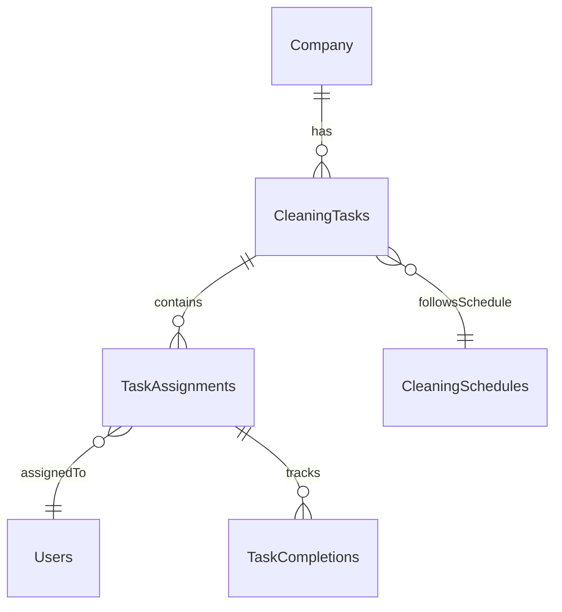

# CleaningTaskTracker Feature - Parking Bay

## Status: PARKED
**Date Parked**: 2025-08-26
**Reason**: Focus on iCleanVerification first

## Feature Overview
A comprehensive task tracking system for managing cleaning operations across all company sites.

## Core Purpose
- Track daily/weekly/monthly cleaning tasks
- Assign tasks to crew members
- Monitor completion status
- Generate compliance reports

## Key Components Identified

### Data Model

### Collections Structure (CSC)
- `csc/cleaningTasks`
- `csc/taskAssignments`
- `csc/taskCompletions`
- `csc/cleaningSchedules`

## Understood Requirements

### Task Management
- Create recurring tasks based on Master Cleaning Schedule
- Auto-generate daily task lists
- Support one-off and recurring tasks
- Task templates for common cleaning procedures

### Assignment Features
- Assign to individuals or teams
- Reassignment capability
- Workload balancing view
- Skill-based assignment suggestions

### Tracking Capabilities
- Real-time status updates
- Progress percentage tracking
- Time tracking (start/stop)
- Location verification (for mobile)

### Reporting
- Daily completion reports
- Weekly compliance summaries
- Individual performance metrics
- Overdue task alerts

## Integration Points
- **Master Cleaning Schedule**: Pull task definitions
- **SCI Documents**: Link to cleaning instructions
- **iCleanVerification**: Trigger verification after task completion
- **Crew Management**: Access crew member profiles
- **Notifications**: Alert for overdue tasks

## Mobile Requirements
- Offline task list access
- Queue status updates for sync
- Photo evidence capture
- Digital signature for completion

## Web Admin Features
- Bulk task creation/editing
- Calendar view of all tasks
- Reassignment dashboard
- Analytics and reporting

## Success Metrics
- Task completion rate > 95%
- On-time completion > 90%
- Reduced paper usage by 100%
- Audit readiness improvement

## Technical Considerations
- Background job for recurring task generation
- Push notifications for task reminders
- Conflict resolution for offline edits
- Performance with 1000+ daily tasks

## Dependencies
- Crew member profiles must exist
- Master Cleaning Schedule integration
- Notification system implementation

## Future Enhancements
- AI-powered task scheduling optimization
- Predictive maintenance suggestions
- Integration with IoT sensors for auto-verification
- Cost tracking per task

## Notes
- Consider relationship with iCleanVerification - tasks could auto-trigger verification
- May need approval workflow for high-risk areas
- Consider compliance scoring impact