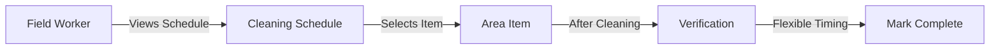

# Self-Inspection Verification Feature

## Current Understanding

### Feature Overview
- **Purpose**: Enable field workers to verify cleaning tasks have been completed according to schedule
- **Core Problem**: Track compliance with cleaning schedules and capture evidence of completion
- **Verification Timing**: After cleaning, flexible within frequency period (e.g., daily can be morning or afternoon)

### User Flow (so far)

### Key Requirements Identified
- Verification happens AFTER cleaning
- Timing based on areaItem frequency (daily, weekly, etc.)
- Flexible completion within frequency period
- Different items completed at different times

## Questions In Progress
- Tracking and compliance requirements...